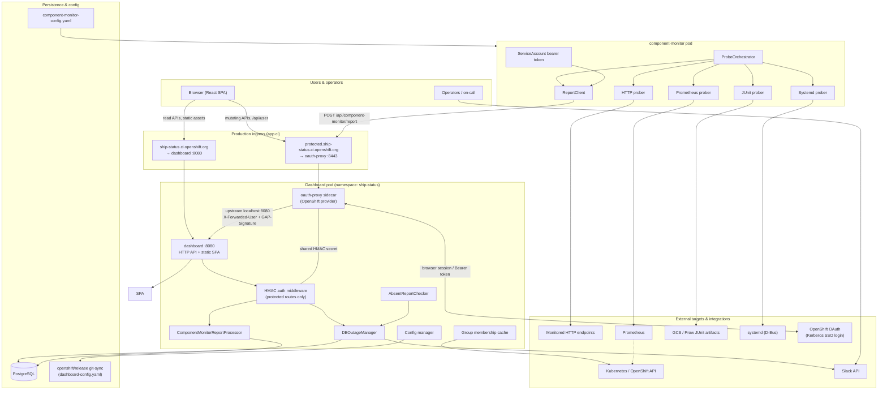
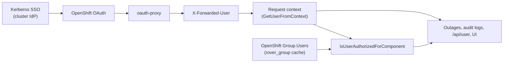

# Ship Status Dashboard — Architecture

High-level dataflow for the Ship Status and Availability Dashboard. For component-specific details, see [`cmd/dashboard/README.md`](cmd/dashboard/README.md) and [`cmd/component-monitor/README.md`](cmd/component-monitor/README.md).

Production Kubernetes manifests live in [openshift/release `clusters/app.ci/ship-status-dash`](https://github.com/openshift/release/tree/main/clusters/app.ci/ship-status-dash).

## System overview



## Production authentication

In production ([dashboard manifests](https://github.com/openshift/release/tree/main/clusters/app.ci/ship-status-dash/dashboard)), the dashboard runs as a **two-container pod**:

| Container | Port | Role |
|-----------|------|------|
| `oauth-proxy` | 8443 | Terminates TLS at the protected ingress; authenticates callers; forwards to the dashboard |
| `dashboard` | 8080 | Serves public traffic directly and receives proxied protected traffic on localhost |

The [Service](https://github.com/openshift/release/blob/main/clusters/app.ci/ship-status-dash/dashboard/service.yaml) exposes two ports: `8080` (public) and `8443` (protected). The [Ingress](https://github.com/openshift/release/blob/main/clusters/app.ci/ship-status-dash/dashboard/ingress.yaml) maps each hostname to the matching port.

`oauth-proxy` is configured with `-provider=openshift`, using the cluster OAuth server and a SubjectAccessReview (`namespaces` `get`) to decide whether a caller may use the proxy. Browser users sign in through **OpenShift OAuth**, which on app.ci uses the cluster identity providers—including **Kerberos SSO** for Red Hat associates—before the proxy issues a session cookie.

Both `oauth-proxy` and `dashboard` read the same HMAC secret (`dashboard-hmac`) so the proxy can sign forwarded requests and the dashboard can verify them.

### Auth flow

```mermaid
sequenceDiagram
    participant Browser as Browser / React SPA
    participant Public as ship-status.ci.openshift.org<br/>(dashboard :8080)
    participant Protected as protected.ship-status.ci.openshift.org<br/>(oauth-proxy :8443)
    participant Proxy as oauth-proxy
    participant OAuth as OpenShift OAuth<br/>(Kerberos SSO)
    participant Dash as dashboard API
    participant CM as component-monitor

    Note over Browser,Public: Public read path — no authentication
    Browser->>Public: GET /api/status, /api/components, …
    Public->>Dash: direct
    Dash-->>Browser: JSON

    Note over Browser,OAuth: Operator write path — interactive login
    Browser->>Protected: POST/PATCH outage, GET /api/user, …
    alt No valid session cookie
        Proxy->>OAuth: Redirect to OpenShift login
        OAuth->>OAuth: Kerberos SSO (or other cluster IdP)
        OAuth-->>Proxy: OAuth callback + tokens
        Proxy-->>Browser: Set session cookie<br/>(domain: ship-status.ci.openshift.org)
    end
    Proxy->>Proxy: Set X-Forwarded-User (username)<br/>Sign request headers (GAP-Signature)
    Proxy->>Dash: Forward to localhost:8080
    Dash->>Dash: Verify HMAC + X-Forwarded-User
    Dash->>Dash: Authorize via owner user / Rover group membership
    Dash-->>Browser: JSON

    Note over CM,Protected: Monitor report path — service account token
    CM->>Protected: POST /api/component-monitor/report<br/>Authorization: Bearer &lt;SA token&gt;
    Proxy->>OAuth: Validate bearer token
    Proxy->>Proxy: Set X-Forwarded-User<br/>(e.g. system:serviceaccount:ship-status:component-monitor)<br/>Sign request (GAP-Signature)
    Proxy->>Dash: Forward to localhost:8080
    Dash->>Dash: Verify HMAC + service account identity
    Dash->>Dash: Authorize if SA listed in component owners
    Dash-->>CM: 200 OK
```

### Protected vs public API routes

The dashboard registers routes on two logical paths ([`server.go`](cmd/dashboard/server.go)):

- **Public** — reachable on `ship-status.ci.openshift.org` without passing through `oauth-proxy`. Includes status, component metadata, and read-only outage endpoints.
- **Protected** — require `X-Forwarded-User` and a valid `GAP-Signature` HMAC. Includes outage create/update/delete, `/api/user`, and `/api/component-monitor/report`.

The React frontend uses two domains in production (`VITE_PUBLIC_DOMAIN` / `VITE_PROTECTED_DOMAIN`), matching this split.

### Authorization after authentication

| Caller | Identity in `X-Forwarded-User` | Authorization check |
|--------|----------------------------------|---------------------|
| Operator (browser) | OpenShift username | Component `owners.user` or membership in configured `rover_group` (via Kubernetes group cache) |
| component-monitor | Service account name | Service account listed in component `owners.service_account` |

### Kerberos / OpenShift usernames in the application

The dashboard never handles Kerberos credentials directly. After **Kerberos SSO** at the cluster login page, OpenShift OAuth establishes the session; `oauth-proxy` forwards the resulting **OpenShift user name** on every protected request as the `X-Forwarded-User` header. That string is the sole interactive identity the application uses—it is the same username stored on OpenShift `Group` objects (Rover groups) in the cluster.



**How authorization is resolved**

Production components are usually owned via `owners.rover_group` in [`dashboard-config.yaml`](https://github.com/openshift/release/tree/main/core-services/ship-status) (git-synced into the pod). On startup and config reload, the dashboard queries the OpenShift **Groups** API for each configured `rover_group` and caches the `users` list ([`pkg/auth/groups.go`](pkg/auth/groups.go)). Authorization is an **exact string match**: `IsUserInGroup(activeUser, rover_group)` compares `X-Forwarded-User` to each member name returned by OpenShift.

The optional `owners.user` field is intended for local/testing overrides (see [`Owner` in `pkg/types/config.go`](pkg/types/config.go)); it uses the same exact match against `X-Forwarded-User`.

**Where the username is used**

| Use | Location | Behavior |
|-----|----------|----------|
| Gate mutating API calls | [`IsUserAuthorizedForComponent`](cmd/dashboard/handlers.go) | Required for POST/PATCH/DELETE on outages; returns 403 if the user is not in any owner `user` or `rover_group` for that component |
| Session / admin scope | `GET /api/user` | Returns `{ username, components[] }` — component slugs the user may administer ([`GetAuthenticatedUserJSON`](cmd/dashboard/handlers.go)) |
| Outage attribution | `outages.created_by` | Set to the active user on manual create ([`CreateOutageJSON`](cmd/dashboard/handlers.go)); shown in the UI and audit history |
| Audit trail | `outage_audit_logs.user` | Recorded on create, update, and delete via GORM hooks using `CurrentUserKey` from the repository ([`pkg/types/models.go`](pkg/types/models.go)) |
| UI affordances | [`AuthContext`](frontend/src/contexts/AuthContext.tsx) | Fetches `/api/user` with cookies; `isComponentAdmin(slug)` enables create/edit/delete controls ([`OutageActions`](frontend/src/components/outage/actions/OutageActions.tsx), [`SubComponentDetails`](frontend/src/components/sub-component/SubComponentDetails.tsx)) |

**What the username is not used for**

- **Public reads** — status and read-only outage endpoints do not require a user identity.
- **Confirmation** — confirming an outage sets `confirmed_at` only; there is no separate `confirmed_by` field. The updating user still appears in audit logs when confirmation changes via PATCH.
- **Component-monitor outages** — automated reports use the service account in `X-Forwarded-User` (e.g. `system:serviceaccount:ship-status:component-monitor`) for `created_by` and a different authorization path (`owners.service_account`), not Rover groups.

**Operational note:** Rover group membership must stay aligned with OpenShift. If a Kerberos-authenticated user cannot mutate outages, verify their name appears in the OpenShift group listed under `owners.rover_group` for that component—the dashboard compares the `X-Forwarded-User` value character-for-character against `Group.users`.

Local development mirrors this layout with [`mock-oauth-proxy`](cmd/mock-oauth-proxy/main.go) (Basic Auth for users, Bearer tokens for service accounts) — see [DEVELOPMENT.md](DEVELOPMENT.md#authentication-architecture).

## Components

| Component | Location | Role |
|-----------|----------|------|
| Dashboard API | `cmd/dashboard` | REST API, outage management, Slack notifications, absent-report watchdog |
| oauth-proxy | Sidecar in prod; `cmd/mock-oauth-proxy` locally | Authentication gateway and HMAC request signing for protected routes |
| Frontend | `frontend/` | React SPA (served as static assets by the dashboard in production) |
| Component monitor | `cmd/component-monitor` | Periodic probes; reports to `https://protected.ship-status.ci.openshift.org` |
| Database | PostgreSQL | Outages, audit logs, report pings, Slack thread metadata |
| Migrations | `cmd/migrate` | Schema migrations (init container in prod) |

## Main data paths

1. **Read path (users)** — Browser → `ship-status.ci.openshift.org` → dashboard :8080 → PostgreSQL / in-memory config.
2. **Write path (operators)** — Browser → `protected.ship-status.ci.openshift.org` → Kerberos SSO / OpenShift OAuth → oauth-proxy → HMAC-signed request → dashboard → PostgreSQL (+ audit logs, Slack).
3. **Monitor path** — Probe orchestrator → external targets → report → `protected.ship-status.ci.openshift.org` (Bearer token) → oauth-proxy → report processor → pings and auto-created/resolved outages in PostgreSQL.
