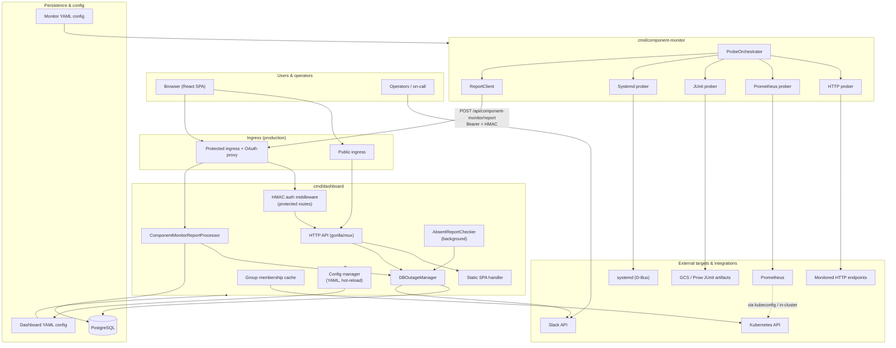

# Ship Status Dashboard — Architecture

High-level dataflow for the Ship Status and Availability Dashboard. For component-specific details, see [`cmd/dashboard/README.md`](cmd/dashboard/README.md) and [`cmd/component-monitor/README.md`](cmd/component-monitor/README.md).

## System overview

## Components

| Component | Location | Role |
|-----------|----------|------|
| Dashboard API | `cmd/dashboard` | REST API, outage management, Slack notifications, absent-report watchdog |
| Frontend | `frontend/` | React SPA (served as static assets by the dashboard in production) |
| Component monitor | `cmd/component-monitor` | Periodic probes and status reports to the dashboard API |
| Database | PostgreSQL | Outages, audit logs, report pings, Slack thread metadata |
| Migrations | `cmd/migrate` | Schema migrations |

## Main data paths

1. **Read path (users)** — Browser → public ingress → dashboard API → PostgreSQL / in-memory config → JSON responses for status and outage views.
2. **Write path (operators)** — Browser → protected ingress (OAuth + HMAC) → dashboard API → outage manager → PostgreSQL (+ audit logs, Slack).
3. **Monitor path** — Probe orchestrator → external targets → merged report → protected ingress → report processor → pings and auto-created/resolved outages in PostgreSQL.
