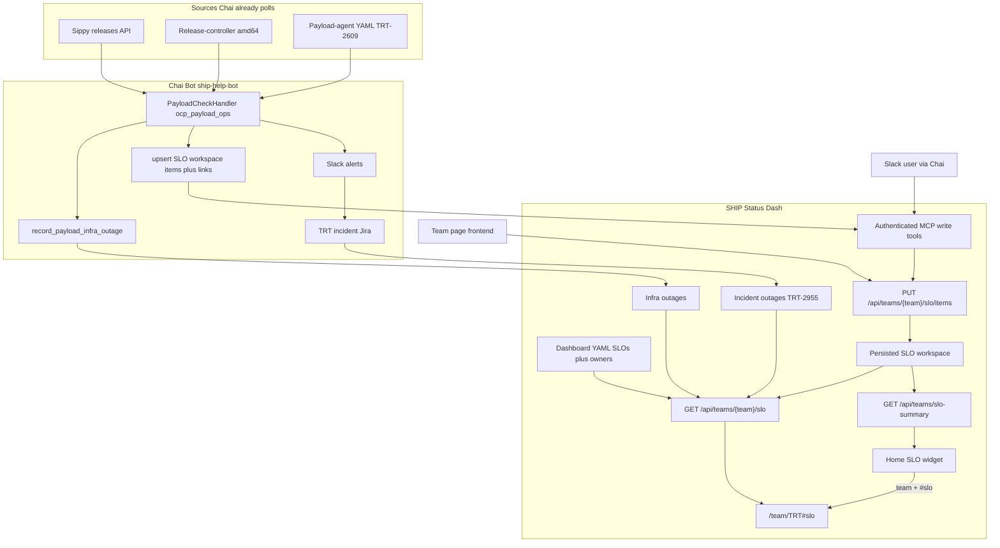

# TRT-2722: Team SLOs and TRT Watcher Canvas in SHIP Status Dash

**Date:** 2026-09-23
**JIRA:** [TRT-2722](https://redhat.atlassian.net/browse/TRT-2722)
**Author:** Stephen Goeddel

Related: [SHIPSTRAT-3](https://redhat.atlassian.net/browse/SHIPSTRAT-3), [TRT-2955](https://redhat.atlassian.net/browse/TRT-2955), [TRT-2433](https://redhat.atlassian.net/browse/TRT-2433), [TRT-2666](https://redhat.atlassian.net/browse/TRT-2666), [TRT-2790](https://redhat.atlassian.net/browse/TRT-2790), [TRT-2609](https://redhat.atlassian.net/browse/TRT-2609)

Chai payload-check / MCP write reliability: assume [ship-help-bot#817](https://github.com/openshift-eng/ship-help-bot/pull/817) has merged (MCP 5xx retries including initialize, watermark holds until YAML loads, ship-status write failures Slack and are not retried automatically). SLO inserts reuse that path. They do not add a second retry stack.

This is a **dual-repo** plan. SHIP Status Dash is the store, evaluator, and UI. Chai Bot ([openshift-eng/ship-help-bot](https://github.com/openshift-eng/ship-help-bot)) is the producer that already watches payloads and files infra outages. The Slack watcher canvas is on-demand only. Neither repo is a follow-up to the other.

## Problem Statement

TRT-2722 asked whether team SLOs need a high-visibility home-page widget or can reuse existing surfaces. The team page (`/team/:team`, TRT-2433) should be the detailed SLO workspace. The home page gets a small summary widget that bubbles key met/missed status per team and deep-links to that team's SLO section. The full watcher canvas does not live on `/`.

TRT's operational SLO is at least one accepted payload per day on watched amd64 streams. A Slack canvas on `#forum-ocp-release-oversight` still exists; Chai only writes it when someone asks. The live picture moves to ship-status (streams, recent payloads, failed jobs, Jira/outage links). Stop asking Chai to update that canvas. There is no scheduled refresh and no canvas cutover.

ship-status does not poll release-controller or Sippy to populate the SLO. Chai already does that in `PayloadCheckHandler` (`ship_help_bot/tools/_auto/payload_check/`). The bot is responsible for keeping SLO data current. Authorized humans can also add and edit the same records from the team-page UI or by asking Chai in Slack. A missed SLO is an indicator only. Never create an outage because an SLO was missed.

Incident outages on `trt-2955` ([TRT-2955](https://redhat.atlassian.net/browse/TRT-2955)) stay as ship-status outages (`trt-incidents/incidents`, `outage_per_reason`, `exclude_from_main_outage_well`). They should not remain a separate team-page card or home component well. Set `slo_component: true` on that component so list APIs omit it, then show its active outages in `SLOComponentWell` and the home SLO well. Other teams can set the same flag on a component of their own, or skip it. Payload rows still link to those outages. They do not replace them.

## Split of responsibilities

| Layer | Owner | Does | Does not |
|-------|--------|------|----------|
| Poll Sippy + release-controller, load payload-agent YAML | Chai `PayloadCheckHandler` (`ocp_payload_ops` / `payload_check_dev`, amd64) | Infra: Rejected tags since last-seen, Accepted only to close outages. SLO: existence reconcile of Accepted/Rejected on YAML streams | ship-status never grows this poller. Scheduled SLO path skips Ready. |
| Payload-agent analysis (TRT-2609) | Existing payload agent | Root-cause YAML/HTML for rejected payloads | Not replaced. Chai consumes the YAML. |
| Infra outages for mapped jobs | Chai `record_payload_infra_outage` (`acting_for=chai-bot`) | Create-or-link Degraded unconfirmed outages, later close from later payloads | Not an SLO miss. Keep this path. |
| TRT incident Jira cards | Chai (`trt_incident_jira` + payload_check revert flow) | File `project=TRT`, labels `trt-incident,ai-generated-jira` | ship-status has no Jira token |
| Incident outages | ship-status `jira_monitor` on `trt-incidents/incidents` | One outage per Jira issue (`outage_per_reason`) | Chai does not copy incidents into `slo_workspace_items` |
| SLO workspace facts | Chai inserts missing in-window tags from `PayloadCheckHandler` via authenticated MCP; humans via team page or Slack refresh tool | Generic rows plus versioned jsonb `details`. TRT maps payloads into `payload_streams` v1. | Scheduled path does not rewrite an existing tag. LLM does not author first insert. |
| SLO met/missed | ship-status, from stored workspace items | For TRT: count `Accepted` in 24h per YAML stream (`group_key`) | Never open/update/resolve an outage for a miss |
| Watcher UI | ship-status `/team/TRT#slo` | Versioned per-team component; recurring-job grouping, correlation, add/edit | Home page is a summary chip only |
| Slack | Chai | Payload-check alerts stay. Stop asking for canvas updates. | Do not scrape canvas HTML. No cutover or pointer rewrite. |

Empty SLO rows are a Chai lag problem (tag still Ready, YAML not loaded, MCP write failed and the tag left the 24h window), not something ship-status backfills. A stored row that later changes phase on the release-controller stays as first written until a human asks Chai to refresh it.

## Current SHIP Status Dash constraints

- [`frontend/src/components/team/TeamPage.tsx`](frontend/src/components/team/TeamPage.tsx) is only a filtered `SubComponentList` (`GET /api/sub-components?team=`). No SLO section, no custom widgets.
- Outages are tied to component/sub-component slugs. Payload tags are ephemeral. They should not become ship-status components.
- [`GET /api/outages/during`](API_ENDPOINTS.md) already supports time-window and `team` filters. That is the join API for overlapping infra/incident outages.
- Jira probing is anonymous (`jira_monitor`). Do not mount a Jira token. Correlation can use issue keys already stored on incident outages (`Reason.Check` and `link_type=jira`).
- [TRT-2790](https://redhat.atlassian.net/browse/TRT-2790) (build02 Sippy pass ratio) was closed as Won't Do because it belonged on an SLO/team page. Out of this v1. Do not add a second TRT evaluator for it here.

## Current Chai Bot constraints

- **Auth path already exists (TRT-2666).** Writes go to authenticated MCP behind oauth-proxy. Chai's SA is a `trusted_delegator`. Identity on the dashboard is `X-Acting-For`: `chai-bot` for autonomous work. User-initiated Slack writes resolve `acting_for` the same way as today's outage tools: `get_github_username()` then `is_github_user_red_hat` → kerberos `uid`. `chai-bot` is already a `user` owner on components so bot-initiated outages authorize. Team SLO writes need the same string on `team_slos.owners`.
- **Discovery already exists.** `ship_help_bot/tools/ship_status/` builds FunctionTools from MCP `tools/list`. New `get_*` / `list_*` tools on the public MCP and new write tools on the auth MCP appear at persona startup (`openshift_ci_tools` includes this toolset). Do not hard-code a second client. Dashboard `acting_for` is the write gate (`authz_required` is false on this toolset, same as today).
- **`PayloadCheckHandler` is the poller, in Python `begin()`, not an LLM turn.** `ocp_payload_ops.payload_check_dev` (every 5 minutes, `architectures: ["amd64"]`, `releases: ocp-dev`) already: asks Sippy which releases are in scope, derives `{version}.0-0.ci` and `{version}.0-0.nightly` (`_streams_for_release`), lists terminal tags since a Firestore watermark (`scheduled_state/trt_payload_check`), loads payload-agent YAML, and records ship-status infra outages via `record_payload_infra_outage_impl`. `_scan_stream_tags` **ignores Ready/Pending**. Accepted tags are fetched only far enough to close infra outages (`_observe_accepted_for_resolution`). `patch_manager.payload_check_ga` is the GA/z-stream sibling and is **out of TRT SLO v1**.
- **[ship-help-bot#817](https://github.com/openshift-eng/ship-help-bot/pull/817) is the write/reliability baseline.** MCP initialize and tool calls retry the same 5xx set (including Retry-After). YAML fetch/parse failure and a missing release-controller detail hold the watermark (`AnalysisStatus.RETRY`) until YAML is ready or there is no payload-agent job. Once YAML is loaded, ship-status writes are best-effort: `failed` (not `skipped`) goes to the Slack prompt via `_ship_backfill_incomplete`; the watermark still advances; the next run does not retry those infra writes. SLO inserts use this client and this Slack/watermark split. Do not add a second MCP retry layer or a Firestore failed-tag queue.
- **Infra writes are a wrapper, not raw `create_outage`.** `record_payload_infra_outage` groups jobs by component/sub-component, queries `get_outages_during`, then creates or links with `bot_initiated=True`, `acting_for=chai-bot`. SLO first-inserts are the same shape: a coordinator helper the handler calls. The LLM does not invent payload rows.
- **SLO cannot piggyback only on the Rejected watermark loop.** That loop skips Accepted-only ticks and only walks later Accepted tags for infra close. "1 accepted / 24h" needs every **Accepted and Rejected** tag on YAML `workspace.streams` in the window. Ready is not inserted on the scheduled path (insert-once would freeze it until a human refresh).
- **Watched streams come from `get_team_slo`, not handler config.** Do not duplicate `workspace.streams` in `ocp_payload_ops.yaml`. Sippy still decides which releases exist for infra backfill. SLO inserts filter to the dashboard YAML list (and `schema_version`) returned by public MCP.
- **Slack canvas is on-demand only.** `ocp_payload_ops` and `trt_internal` can `update_canvas` on `forum_ocp_release_oversight_canvas` when a human asks. There is no scheduled canvas-refresh job. Do not scrape that canvas, rewrite it as a pointer, or dual-write. Once `/team/TRT#slo` is live, stop asking Chai to update it. Payload check still posts actionable Slack (reverts, force-accept, newly created ship-status outages, and #817-style write failures).
- **Incident filing stays on Chai.** Revert buttons already create TRT Jira incidents in the **LLM** turn after the Slack prompt (`trt_payload_check_handler.md` / `trt_incident_jira`). The handler does not file Jira. The ship-status `jira_monitor` turns those issues into `trt-incidents/incidents` outages. SLO workspace tools only **link** an item or job group to that outage (instruction update on that revert path, not Python in `begin()`).
- **RWS: do not copy infra exposure.** `record_payload_infra_outage` is RWS-exposed only for `ocp_payload_ops` because payload-agent workers record infra from YAML. SLO rows are maintained by `payload_check` on the coordinator (`__init__.py` already says Prow-analyzed payloads stay on that handler). SLO insert/refresh wrappers are `rws_agent_register=False`. Raw discovered `upsert_slo_item` stays off RWS the same way raw `create_outage` does (`get_*` / `list_*` only).
- **Missed SLO must not call `create_outage`.** Instructions need an explicit rule. Infra and incident outages remain the only outage writers.

## Recommended product shape

Treat this as three layers:

1. **Home-page SLO summary** (small, all teams): met/missed chips, one line of context, compact `slo_component` incident rows, link to `/team/{team}#slo`. Not the watcher canvas. Does not light the ship-on-fire logo.
2. **Generic SLO status** on the team page: named objectives, window, met/missed, last evaluation (`id="slo"`), plus one well per `slo_component` (title from that component's configured name).
3. **SLO workspace** (pluggable, writable, versioned): generic rows (`kind`, `schema_version`, `item_key`, `group_key`, `outcome`, jsonb `details`). TRT's workspace is the amd64 payload watcher (`kind: payload_streams`, `schema_version: 1`). The team page renders with a versioned component for that schema, not a generic jsonb explorer.



### TRT team page layout

Keep the existing sub-component grid below. Add sections above it:

**SLO strip** (all teams with config, `id="slo"`): e.g. "Accepted payload / 24h: 3 of 4 streams meeting target." This is the target of the home-page deep link. Missed SLOs are prominent here as status only. Do not light the ship-on-fire logo. Do not create an outage when an SLO is missed.

**SLO component well** (any team that owns a `slo_component: true` component): a generic outage list for that configured component and its subs. Heading is the component name (and sub-component name when useful). TRT's example is `TRT Incidents` / `Incidents`. Other teams may have no such component, or one named something else. Not a `SubComponentCard` in the grid. Not a hardcoded "Incidents" page.

**Watcher canvas** (TRT `payload_streams` v1 workspace, amd64 only):

- One table per stream in YAML `workspace.streams` (amd64 ci and nightly). The mock shows 5.0 and 5.1. When 5.0 GAs, remove those names from YAML. No arm64/multi/ppc/s390x.
- Last N payloads **on the team page** (`recent_payloads`). The store keeps every tag still inside the SLO `window` so evaluation is not limited to those N rows. Home does not list payloads.
- Recurring-job grouping: same blocking job failing on 2+ consecutive payloads in that stream. Computed by ship-status from stored rows so Chai does not have to send a grouping structure.
- Every payload row links to its release-controller page (`details.payload_url`). Rejected (and Ready, when the agent has output) also link to payload-agent analysis HTML (`details.analysis_url`).
- Each failed blocking job can carry a `notes` string (bot or human). That is separate from payload-wide `slo_workspace_items.notes`.
- Other links: Prow (job URL), Jira, ship-status outage details (and any extra URLs attached on `slo_workspace_links`).
- Correlated ship-status objects beside a payload or a failure group:
  - TRT incident outages whose Jira key appears on the group, or whose window overlaps payload evaluation.
  - Infra outages (`GET /api/outages/during`) so "build02 down" explains a GCP job streak. These are the outages Chai already opened via `record_payload_infra_outage`.
  - Explicit outage/Jira links attached by the bot or the UI.

Authorized users on the team page can add a payload, edit phase/jobs/per-job notes/payload notes, and add/remove links. Same protected APIs as MCP. Empty/stale data is a bot-lag problem, not something ship-status backfills from release-controller.

### Visual mockup

Static mock of `/team/TRT` with the SLO strip, `SLOComponentWell` (titled TRT Incidents), amd64 payload streams, and the existing Sippy cards. Sample payload/incident data. Layout is based on the live team page ([ship-status.ci.openshift.org/team/TRT](https://ship-status.ci.openshift.org/team/TRT)) as of 2026-09-25, when that page listed Sippy, Sippy-Auth, and Incidents.

Yellow italic lines labeled **Mock caption** are annotations for these screenshots, not product copy.


Home page: In Outage stays first. A Team SLOs well under it lists per-team roll-up and, in a nested well labeled with the component and sub-component names, the `slo_component` incident outages. TRT Incidents is not a component well. Payload tables stay on the team page.


What changed vs today:

- Team header title is the team name (`TRT`), not `TRT Sub Components`.
- New SLO strip (`#slo`) and generic SLO-component well (TRT's is titled TRT Incidents) above the grid.
- `Incidents` is not a sub-component card (`slo_component: true` on TRT Incidents). Sippy and Sippy-Auth remain.
- Payload streams are tables per amd64 nightly and ci stream (5.0 and 5.1 in the mock). Each payload has a Release controller link. Rejected rows also have a Payload agent link. Failed blocking jobs show Prow links, optional per-job notes, recurring badges, and Jira/outage links.
- Add payload (section button) and per-row Edit (authorized users). They open the same small v1 dialog. Not on the public read-only view.

### Home-page SLO widget

Place a compact well on [`frontend/src/components/ComponentStatusList.tsx`](frontend/src/components/ComponentStatusList.tsx) immediately below `UnhealthyWell` (In Outage) and above the component wells. In Outage is always the top well when it has items. Do not put SLOs above it.

Per team in the union of `team_slos` entries and `ship_team` values on any `slo_component` (incident-only teams must appear):

- Team name (existing `TeamChip` color) linking to `/team/{team}#slo`
- If the team has `team_slos`: roll-up (all met / N of M missed), worst-miss hint (e.g. "5.0 nightly: last accepted 32h ago"), stream chips. Click-through goes to `#slo`, not a payload row.
- If the team owns a `slo_component`: a nested well inside that team's SLO block, labeled with the component name and sub-component name (e.g. `TRT Incidents` / `Incidents`). Compact outage rows in that well, not loose under the SLO chips. Link to outage details and the team-page well.
- A team with only `slo_component` (no `team_slos`) still gets a block: chip plus nested incident well, no payload roll-up.

Rules that keep `/` from becoming the canvas:

- No payload lists, job failures, or correlation on the home widget
- Teams with no SLO config and no `slo_component` are omitted
- Missed SLOs do not put the team in the In Outage well, do not light the ship fire, and do not create an outage.
- Hide the well entirely if no teams have SLOs or `slo_component`s (local/e2e without YAML)
- A `slo_component` is omitted from home `ComponentWell`s. Its outages appear in this SLO well (and `SLOComponentWell` on the team page), not as a component card.

### Folding incident components into SLOs

Keep TRT-2955's data model: one ship-status outage per Jira issue, Jira probe, `outage_per_reason`, auto-resolve, existing MCP outage tools. Do not copy incidents into `slo_workspace_items`.

Do not derive hide-from-list from `team_slos`. That couples two configs and is easy to get wrong. Add an explicit component flag:

```yaml
  - name: "TRT Incidents"
    description: "TRT Jira incidents labeled trt-incident"
    ship_team: "TRT"
    slo_component: true
    sub_components:
      - name: "Incidents"
        exclude_from_main_outage_well: true
        monitoring:
          outage_per_reason: true
          auto_resolve: true
```

`slo_component: true` on the **component**:

Wire it through the config contract, not only YAML examples:

- [`pkg/types/config.go`](pkg/types/config.go) `Component`: add `SLOComponent bool` with `json:"slo_component,omitempty" yaml:"slo_component,omitempty"`. Same pattern as `ExcludeFromMainOutageWell` on the sub. YAML load already unmarshals `Component`; without this field the flag is dropped.
- Frontend [`frontend/src/types.ts`](frontend/src/types.ts) `Component`: add `slo_component?: boolean` so clients can ignore flagged rows if a list handler ever leaks one.
- Set `slo_component: true` on TRT Incidents in [`hack/local/dashboard/config.yaml`](hack/local/dashboard/config.yaml) and the production file in `openshift/release`.

Behavior:

- `GET /api/components` omits it, so there is no home `ComponentWell`.
- `GET /api/sub-components` omits its subs, so `/team/TRT` has no Incidents card (Sippy stays).
- It still does not appear in the In Outage well or light the ship (`exclude_from_main_outage_well` stays on the sub as today; `slo_component` does not replace that).
- `GET /api/teams/{team}/slo` and `GET /api/teams/slo-summary` include its active outages for `ship_team`.
- Home SLO well and `SLOComponentWell` render those outages. On home, they live in a nested well labeled with the component and sub-component names.

`team_slos` does not need an `incidents:` pointer. Discovery is: components with `slo_component: true` and matching `ship_team`. A team can have a `slo_component` with no payload SLO, or a payload SLO with no `slo_component`.

| Today | After |
|-------|--------|
| `TRT Incidents` is a home component well and a `/team/TRT` card | Hidden from those grids via `slo_component: true` |
| Incidents only excluded from the In Outage well / ship fire | Also excluded from home component wells and the team sub-component list |
| Team page is a flat card grid | SLO section owns the incident list; home SLO well shows the same outages compactly |

Outage create/update/link/triage stays on the existing component APIs and MCP tools. The SLO panel is a view plus deep links. Payload correlation uses these outages first (Jira key, time overlap, and explicit `slo_workspace_links`).

`SLOComponentWell` is generic via YAML. Other teams can flag a component or skip it. v1 does not add another evaluator or another team's workspace UI.

## Data sources

| Need | Source | Auth |
|------|--------|------|
| Entire TRT SLO workspace (items, jobs in jsonb, notes, Jira keys) | Chai `PayloadCheckHandler` via MCP, or authorized humans via the team-page UI / Slack | oauth-proxy + HMAC + team SLO owners (`chai-bot` for bot-initiated) |
| Open TRT incidents as outages | Existing `jira_monitor` + `outage_per_reason` (issues Chai already files) | Anonymous Browse |
| Overlapping infra/incident outages | `GET /api/outages/during` (includes Chai's `record_payload_infra_outage` rows) | Public read |
| Slack narrative (reverts, force-accept) | Unchanged payload_check Slack path | Existing |

SHIP Status Dash does not poll release-controller, Sippy, or Slack to fill the SLO. Chai (or a human) must upsert workspace items. Do not scrape the Slack canvas. Once the team page is live, stop asking Chai to update it.

## Config model

Add team-scoped SLO config to dashboard YAML (production file lives in `openshift/release` `core-services/ship-status/`. Local mirror in [`hack/local/dashboard/config.yaml`](hack/local/dashboard/config.yaml)). Named SLOs attach to team. Incident components use `slo_component: true` on the component. `workspace.kind` plus `workspace.schema_version` is the contract Chai and ship-status share. `payload_streams` v1 is TRT's first pair, not the table layout.

Sketch:

```yaml
team_slos:
  - team: TRT
    owners:   # required. Same shape as component owners. Include chai-bot.
      - rover_group: "technical-release-team"
      - user: "chai-bot"   # bot-initiated acting-for, same as TRT-2666
    slos:
      - name: accepted-payload-per-day
        display_name: "1 accepted payload per day"
        source: payload_acceptance
        workspace:
          kind: payload_streams
          schema_version: 1    # required when workspace is set; Chai and the UI must match
          recent_payloads: 5   # team-page list size only; evaluation uses the hardcoded 24h window
          streams:
            - controller: amd64
              name: "5.1.0-0.nightly"
            - controller: amd64
              name: "5.1.0-0.ci"
            - controller: amd64
              name: "5.0.0-0.nightly"
            - controller: amd64
              name: "5.0.0-0.ci"
```

`source` is the extension point. v1 implements `payload_acceptance` only. Unknown `source` values are ignored.

### Stream lifecycle (drop 5.0, add 5.2)

The watched set is `workspace.streams` in dashboard YAML (`openshift/release`, git-sync). Edit that list when a version GAs or a new nightly opens. No Sippy snapshot API.

**Add 5.2:** PR the two amd64 names onto `workspace.streams`. After git-sync, evaluation and the UI include those tables. Chai starts inserting new 5.2 tags on the next tick. Until the first `Accepted` in `window`, that stream is a miss.

**Drop 5.0:** PR those names off the list. After git-sync they leave the SLO strip, home chips, and payload tables. Chai stops inserting new 5.0 tags. Existing 5.0 rows stay until normal window prune. Do not DELETE them. Do not keep scoring them: leftover 5.0 Rejected tags must not miss the team SLO after we stopped watching.

Do not infer the watched set from leftover `group_key`s in the database. YAML is the list.

### How met/missed is computed

This is not a generic query over jsonb. Ship-status registers evaluators in Go, keyed by `source`. YAML only names the evaluator (`source: payload_acceptance`). Window and target live in that Go code, not YAML: 24h and `min_accepted: 1`. v1 ships that one evaluator.

`payload_acceptance` (TRT, this repo):

1. Take `workspace.streams` from YAML (not every `group_key` in the table).
2. For each of those streams, select stored items with `kind=payload_streams`, `group_key` equal to that stream name, and `occurred_at` inside the last 24h.
3. Count items whose `outcome` is `Accepted`.
4. That stream is met if the count is at least 1.
5. The named SLO is met when every YAML stream is met. Names not in YAML are ignored even if rows remain.

Those steps use version-stable columns only (`group_key`, `occurred_at`, `outcome`). Job notes, payload URLs, and recurring-job grouping are display. They do not change met/missed.

Results are computed on read (no evaluation table). They go to the UI on the public GET APIs below. Never open, update, or resolve a ship-status outage because an SLO was missed.

Generic across teams: YAML shape, evaluator registry, result shape, `TeamSLOStatus` strip. Not generic: pretending every team's SLO is `payload_acceptance`.

`schema_version` is an integer on the workspace, not a YAML comment. Ship-status owns the document for each `(kind, schema_version)` (Go types plus a JSON schema in this repo). Chai's upsert wrapper must send that version. A bump is a coordinated change: ship-status validator and renderer first, then Chai producer, then YAML. Do not silently coerce an unknown version.

`owners` is required (same shape as component owners). Include `user: chai-bot` for bot-initiated writes. `IsUserAuthorizedForTeamSLO` uses only this list. Writes never authorize against the public route.

## Backend design

Persist the workspace. Do not poll release-controller. SLO met/missed is computed only from stored rows the bot or UI wrote.

Do not make `slo_payloads(stream, tag, phase)` a first-class schema. Those names are TRT payload-controller vocabulary.

Tables (names indicative):

- `slo_workspace_items`: `team`, `kind` (same as YAML `workspace.kind`, e.g. `payload_streams`), `schema_version` (integer, required), `item_key` (opaque unique id within team+kind), optional `group_key` (UI/eval grouping), `occurred_at`, `outcome` (opaque string), `details` jsonb, `notes`, `updated_by`, `updated_at`. Unique `(team, kind, item_key)`.
- `slo_workspace_links`: item id, url, `link_type` (`jira` / `outage` / `other`), optional `outage_id`.

`details` is PostgreSQL jsonb (same as `outage_audit_logs.old` / `.new`). Its shape is defined by `(kind, schema_version)`, not by team name and not by "whatever Chai sent today". Ship-status validates upserts against that document. It does not add typed job columns when Chai grows a field. Bump `schema_version` instead.

`schema_version` lives on the row (and in YAML), not buried only inside jsonb. The frontend must know which renderer to load before it parses `details`.

Write rules:

- Reject upserts with a missing `schema_version`.
- Reject upserts whose `(kind, schema_version)` this ship-status build does not know, or whose `details` fail that version's JSON schema.
- Accept older versions that this build still has a validator and renderer for, so a 24h window can mix v1 and v2 during a rollout.
- Do not rewrite stored `details` in place when bumping. New tags arrive at the new version. Existing rows stay until a human asks Chai to refresh that payload.
- Scheduled Chai writes each `(team, kind, item_key)` once. Later handler ticks skip that key. Replace only when a human asks (Slack `refresh_slo_payload_item` or team-page edit). Last write then wins, including `jobs[].notes`. Chai is the usual author on the first insert (payload-agent text when YAML is ready). Humans can add or edit afterward without the next tick clobbering them.

TRT mapping (producer and `payload_streams` v1 UI only, not the generic table):

| Generic column | TRT v1 value |
|----------------|-----------|
| `kind` | `payload_streams` |
| `schema_version` | `1` |
| `group_key` | stream name (`5.1.0-0.nightly`) |
| `item_key` | payload tag |
| `occurred_at` | tag timestamp |
| `outcome` | `Accepted` / `Rejected` / `Ready` |
| `details` | v1 document: release-controller URL, payload-agent analysis URL, failed blocking jobs with optional per-job notes |

TRT `payload_streams` v1 `details` (indicative, frozen in the JSON schema this repo will ship):

```json
{
  "payload_url": "https://amd64.ocp.releases.ci.openshift.org/releasestream/5.1.0-0.nightly/release/5.1.0-0.nightly-2026-09-25-060000",
  "analysis_url": "https://storage.googleapis.com/test-platform-results/payload-agent/5.1.0-0.nightly-2026-09-24-180000.html",
  "jobs": [
    {
      "name": "periodic-ci-...",
      "url": "https://prow.ci.openshift.org/...",
      "state": "failure",
      "notes": "Same disruption as TRT-4120. Not infra."
    }
  ]
}
```

`payload_url` is required (release-controller page for that tag). `analysis_url` is the payload-agent HTML when present (typical for Rejected). `jobs[].notes` is optional. Payload-wide notes stay on `slo_workspace_items.notes`, not in this document. A field added later is a new `schema_version`, not a quiet extra key on v1.

Idempotent **insert** by `(team, kind, item_key)` on the scheduled path: if the row exists, skip. Persist every stored row whose `occurred_at` still falls inside the SLO `window` (24h for TRT). `recent_payloads` is a team-page UI cap only for `payload_streams`. The home widget does not list workspace rows (roll-up, worst-miss, and compact `slo_component` incident rows). Do not prune stored rows down to N. An in-window `Accepted` outcome must remain available to `payload_acceptance` even if later Rejected tags have pushed it off the visible list. Prune only rows that are outside both the evaluation window and the last-N display set.

**Public read APIs:**

- `GET /api/teams/{team}/slo`: team page. Evaluations from stored items in the evaluator's window (not limited to last N), `slo_components` (flagged components plus their active outages), last-N workspace items for YAML streams, and `workspace.schema_version`. Names removed from YAML are omitted even if rows remain.
- `GET /api/teams/slo-summary`: home widget. One block per team in the union of `team_slos` and `slo_component` `ship_team`s. Roll-up when `team_slos` exists; compact incident rows grouped by `slo_component`. No workspace item lists. Home does not load versioned workspace components.
- `GET /api/components` and `GET /api/sub-components` omit `slo_component: true` components (and their subs).

The evaluator returns display fields (`window`, `target`) so the UI does not hardcode 24h / min 1. Indicative team-page body:

```json
{
  "team": "TRT",
  "workspace": { "kind": "payload_streams", "schema_version": 1, "recent_payloads": 5 },
  "evaluations": [
    {
      "name": "accepted-payload-per-day",
      "display_name": "1 accepted payload per day",
      "source": "payload_acceptance",
      "window": "24h",
      "target": { "min_accepted": 1 },
      "met": false,
      "groups": [
        { "key": "5.1.0-0.nightly", "accepted": 1, "met": true, "last_accepted_at": "2026-09-25T06:00:00Z" },
        { "key": "5.0.0-0.nightly", "accepted": 0, "met": false, "last_accepted_at": "2026-09-23T22:00:00Z" }
      ]
    }
  ],
  "slo_components": [
    {
      "component": "TRT Incidents",
      "sub_component": "Incidents",
      "outages": []
    }
  ],
  "items": []
}
```

`TeamSLOStatus` reads `evaluations`. `SLOComponentWell` reads `slo_components` (heading from `component` / `sub_component`). `PayloadStreamsWorkspace` reads `items` plus `workspace`. Home `GET /api/teams/slo-summary` is the same evaluations rolled up plus compact outage rows grouped by those configured names. No payload `items`.

**Protected write APIs** (oauth-proxy + HMAC + `IsUserAuthorizedForTeamSLO`). Used by MCP and the frontend:

- `PUT /api/teams/{team}/slo/items`: create or replace one workspace item (`kind`, `schema_version`, `item_key`, `group_key`, `occurred_at`, `outcome`, `details`, `notes`).
- `PATCH` (or PUT of a subset) for edits.
- `PUT /api/teams/{team}/slo/items/{kind}/{item_key}/links`: attach Jira or outage.
- `DELETE` for item or link mistakes.

`payload_acceptance` is the evaluator named in YAML (see above). Recurring-job grouping and any other `details` parsing stay versioned next to the renderer. The tables stay generic so TRT does not need `stream` / `tag` / `phase` columns. v1 does not ship another team's workspace.

## Chai Bot (ship-help-bot) design

Reuse the TRT-2666 path. Contract lives in this repo (REST + MCP). Producer lives in ship-help-bot. Assume [ship-help-bot#817](https://github.com/openshift-eng/ship-help-bot/pull/817) has merged before this work: MCP 5xx retries (including initialize), `AnalysisStatus.RETRY` holds the watermark until YAML loads, create/link/update errors are `failed` not `skipped`, and `_ship_backfill_incomplete` pages Slack without retrying infra writes.

### MCP contract (this repo)

**Public MCP (read):**

- `get_team_slo(team)` (streams, `schema_version`, existing items)
- `get_team_slo_summary()`

Name them `get_*` so Chai's ship_status discovery routes them to the public endpoint automatically.

**Authenticated MCP (write), `acting_for` required:**

- `upsert_slo_item(team, kind, schema_version, item_key, group_key, occurred_at, outcome, details, notes, acting_for, ...)`
- `add_slo_item_link(team, kind, item_key, url, link_type, outage_id?, acting_for)`
- Existing `create_outage` / `add_outage_link` stay the way to file a TRT incident or infra outage. Workspace tools link to that outage rather than duplicating it.

TRT's handler maps stream/tag/phase/jobs into those arguments and always sets `schema_version` from `get_team_slo` (the published `payload_streams` contract). It does not require MCP tools named `stream` / `tag` / `phase`. If ship-status rejects the version, treat it like any other failed upsert (Slack via the #817 prompt path). Do not guess a fallback schema.

Bot-initiated: `acting_for: chai-bot` (locked, same owner string as TRT-2666). User-initiated in Slack: `get_github_username` then `is_github_user_red_hat` → kerberos `uid` (same as `02_write_tools.md` today). Frontend writes use the logged-in user (no acting-for). Dashboard audit logs the acting identity (`chai-bot` or the human).

Do not mount a Jira token on ship-status. Chai already has Jira tools. It sends issue keys/URLs as links.

### Producer: extend PayloadCheckHandler, do not add a second poller

Owner persona: **`ocp_payload_ops`** (`payload_check_dev`, amd64, `ocp-dev`). Not `patch_manager` (GA) and not a new scheduled persona.

Keep `_backfill_ship_status` / `record_payload_infra_outage_impl` as they are after #817. Add a coordinator wrapper next to `payload_infra.py` (sandbox fake, `acting_for=chai-bot`). Call it from Python `begin()`, the same way infra backfill is called. The LLM does not choose payload rows.

**Write each payload once.** The scheduled path inserts a row the first time `(team, kind, item_key)` is missing from ship-status. Later ticks skip that key even if phase, jobs, or YAML changed. A human must ask for an update (`refresh_slo_payload_item` or team-page edit). Adding a Jira or outage **link** after the fact is not a payload rewrite.

SLO first-insert is **existence-based**, not last-seen-based. The Firestore watermark stays the infra/Slack cursor from #817. Reconcile from `get_team_slo` plus release-controller:

1. `get_team_slo("TRT")` for `workspace.streams`, `schema_version`, and existing `item_key`s. Skip streams not in that YAML list. Do not copy the stream list into handler config.
2. For each watched stream, list release-controller tags in the evaluation window. Insert **Accepted and Rejected** only. Skip Ready and Pending (insert-once would freeze a Ready row). Skip any tag that already exists.
3. `details.payload_url` always from `build_release_tag_url` (already used by `release_controller` tools; payload_check should call it too). `details.jobs` are release-controller **blocking** jobs (`blockingJobs` / verification already loaded in `_get_release_detail`), not informal or optional jobs. When payload-agent YAML is `READY`, set `details.analysis_url` from the HTML URL and copy per-job `notes` from YAML when present. Accepted tags do not wait on YAML. Do not copy YAML `failing_jobs` wholesale; those mix infra findings the SLO table does not own.
4. Rejected tags that still have `PENDING` or `RETRY` analysis are not inserted this tick. #817 already holds last-seen until YAML loads or there is no payload-agent job (`UNAVAILABLE`). Insert on that later READY/UNAVAILABLE tick so jobs and notes are complete.
5. Keep calling `record_payload_infra_outage_impl` for Rejected tags with mapped infra jobs. Unchanged. When that wrapper creates or links an outage, `add_slo_item_link(..., link_type=outage, outage_id=...)` if the payload row exists.
6. Jira links are **not** in `begin()`. When the Slack revert flow files a TRT incident, `trt_payload_check_handler.md` also calls `add_slo_item_link(..., link_type=jira)` for the affected payload(s). Do not wait for `jira_monitor`.
7. Failed SLO inserts use the same `WriteAction.FAILED` / `_ship_backfill_incomplete` Slack path as #817 infra failures. Do not hold last-seen on ship-status errors. Do not add a Firestore failed-tag queue. A missing in-window tag is retried on the next tick because `get_team_slo` still lacks that key. Infra write failures stay non-retried (#817). There is no automatic rewrite of an existing row (Ready-to-Accepted, new analysis).

Human recovery when a tag left the window still missing, or a stored row is stale:

- Ask Chai in Slack to refresh that stream and tag. This is a coordinator `@tool` (`refresh_slo_payload_item`), not a plugin skill: look up current phase and blocking jobs from the same release-controller / YAML sources, then `upsert_slo_item` **replacing** the row. Independent of last-seen. The LLM only invokes it on explicit user intent. It does not invent phase or jobs.
- Or team page add/edit (same protected `PUT` as MCP).

Persona-callable tools remain for humans ("add a note on 5.1 nightly 2026-09-23-…", "link TRT-1234 to this payload", "refresh 5.1.0-0.nightly-2026-09-25-060000 on the SLO"). Those use kerberos `acting_for` from GitHub/Rover, same as today's outage writes. Instructions: only on explicit user intent, same as raw `create_outage`.

Tests follow `tests/test_payload_check_handler.py` and `tests/test_ship_status_payload_infra.py`: missing Accepted is inserted, existing tag skipped, Ready skipped, RETRY/PENDING not inserted, failed upsert pages Slack without advancing a failed-tag queue.

### Slack canvas

The oversight canvas is on-demand only. No scheduled writer, so no cutover: do not dual-write, do not replace the canvas body with a ship-status URL, do not scrape it. After `/team/TRT#slo` is the live view, stop asking Chai to `update_canvas` for payload/SLO status.

**Alerts stay in Slack.** Revert / force-accept / new infra outage posts from payload_check do not move into the dashboard. Failed ship-status writes (infra or SLO insert) use the #817 unrecovered-tip prompt. Recovered streams stay silent. Point at `refresh_slo_payload_item` and `/team/TRT#slo`.

### Instructions and safety

Update in ship-help-bot (not this repo):

- `ship_help_bot/tools/ship_status/instructions/02_write_tools.md`: new upsert/link/refresh tools, `acting_for` rules, **never create an outage because an SLO was missed**.
- `ship_help_bot/tools/_auto/payload_check/README.md` and handler module doc: existence-based insert-once beside the #817 infra backfill. Do not rewrite an existing tag on later ticks.
- `trt_payload_check_handler.md`: mention `/team/TRT#slo` when posting; after filing incident Jira, `add_slo_item_link`; do not treat SLO miss as an incident. Slack failed SLO inserts through `_ship_backfill_incomplete` (stream, tag, error, how to refresh).
- `refresh_slo_payload_item`: explicit user intent only. Watermark-independent replace. Covers a missing payload, a write that aged out of the window, or a stale stored row. Scheduled `begin()` never calls it.
- RWS: `rws_agent_register=False` on SLO insert/refresh wrappers. Do not copy `record_payload_infra_outage`'s RWS exposure. Keep raw `upsert_slo_item` off workspace workers (`get_*` / `list_*` only).

### What Chai does not do in v1

- Evaluate met/missed (ship-status does that from stored rows).
- Recurring-job grouping (ship-status derives it).
- Replace the payload agent.
- Open a ship-status outage per rejected payload or per missed SLO.
- Automatically rewrite a payload the scheduled handler already inserted (phase change, new analysis, Ready-to-Accepted). Humans ask Chai to refresh a specific tag.
- Invent or coerce `schema_version`. If ship-status rejects the document, Slack a human.
- Retry infra writes after YAML was loaded (#817). Existence retry applies only to **missing** SLO keys.
- A second MCP client or a Firestore failed-tag queue.

## Frontend design

**Team page** ([`frontend/src/components/team/TeamPage.tsx`](frontend/src/components/team/TeamPage.tsx)):

1. Fetch `/api/teams/{team}/slo`. If empty, keep today's page.
2. `TeamSLOStatus` strip with `id="slo"` (generic, all teams) from `evaluations` on that response. Scroll into view when the hash is `#slo`.
3. If the team has any `slo_component`, render `SLOComponentWell` once per flagged component. Title and `id` come from the configured names (TRT: `TRT Incidents`, `#slo-component-trt-incidents`). Active outage rows link to existing details pages. Do not hardcode the word Incidents.
4. If the team has a workspace, render from a **versioned per-team registry**. Do not parse `details` in a shared generic table.
5. Existing `SubComponentList` unchanged except list APIs no longer return `slo_component` subs.

Workspace registry (indicative):

```
frontend/src/components/team/slo/
  TeamSLOStatus.tsx
  SLOComponentWell.tsx
  registry.ts
  unknown/UnknownSLOWorkspace.tsx
  trt/v1/PayloadStreamsWorkspace.tsx
```

`registry.ts` maps `(team, kind, schema_version)` to a React component. TRT v1 is `payload_streams` / `1` → `trt/v1/PayloadStreamsWorkspace`. Bumping TRT's `details` shape means `trt/v2/...` plus a ship-status JSON schema `payload_streams` v2. Leave v1 mounted until no displayed rows still use it.

Team page lookup:

- Group displayed items by `schema_version`.
- For each group, load `registry[team][kind][schema_version]`.
- Unknown pair: `UnknownSLOWorkspace` (kind, version, item count). Do not guess fields. Do not crash the rest of the team page.
- When the viewer is authorized, the versioned component owns add/edit for **that schema only**. Unknown versions have no write UI.

### Frontend add/edit (minimal)

This is a backstop. Chai Slack is the usual way to refresh a payload. Do not build a generic jsonb editor or a per-field CRUD page.

- One MUI dialog, same idea as [`UpsertOutageModal`](frontend/src/components/outage/actions/UpsertOutageModal.tsx). Create and edit share it. Lives next to the renderer: `frontend/src/components/team/slo/trt/v1/UpsertPayloadItemDialog.tsx`.
- `schema_version` is a constant in that folder (`1`). Not a form field. Writes always send that version. A v2 renderer ships its own dialog.
- Show **Add payload** and per-row **Edit** only when signed in (`AuthContext`), same as outage actions. Public visitors do not see them. The API still enforces `IsUserAuthorizedForTeamSLO` (403 if not an owner).
- v1 fields: stream (YAML `workspace.streams` on create; locked on edit), tag (`item_key`, locked on edit), `occurred_at`, `outcome`, `payload_url`, optional `analysis_url`, repeating job rows (`name`, `url`, `notes`), payload `notes`. Links can be a URL + type on the same dialog or a second tiny control that hits the links PUT.
- Submit: protected `PUT /api/teams/{team}/slo/items` with `kind=payload_streams` and `schema_version=1`. No PATCH required in v1.
- Do not add stream-level bulk edit, JSON textarea, or job-schema versioning in the form.

Home stays generic. It never imports team workspace components.

Deep links: `/team/TRT#slo` from the home widget, `/team/TRT#stream-5.1.0-0.nightly` within the TRT v1 canvas, outage details and Jira browse URLs from failure groups.

**Home page** ([`frontend/src/components/ComponentStatusList.tsx`](frontend/src/components/ComponentStatusList.tsx)):

1. Fetch `/api/teams/slo-summary` next to the existing components/status polls.
2. If the payload is non-empty, render `TeamSLOSummaryWell` **after** `UnhealthyWell` and before the component wells. In Outage stays the top well. Include teams that have only a `slo_component`.
3. Each team block is a `TeamChip` plus SLO roll-up plus worst-miss hint. Under that, a nested well per `slo_component` labeled with component and sub-component names, containing compact incident rows. "View SLO" navigates to `/team/{team}#slo`. Incident rows link to outage details.

Public route is read-only. All SLO mutations (bot MCP and frontend add/edit) use the protected route and `IsUserAuthorizedForTeamSLO`. `chai-bot` is an owner for bot-initiated MCP. Human UI users must be a rover-group/user owner of that team SLO.

## Correlation with incident outages (TRT-2955)

`SLOComponentWell` for TRT is the TRT-2955 list, not a second copy. Correlation is then:

- Show those active outages in `SLOComponentWell`.
- For each recurring job group, list incident outages whose Jira key is already linked (`add_slo_item_link` or `Reason.Check` match), or whose window overlaps the failing payload span.
- For each payload, also list overlapping Build Farm / Prow outages so infra vs product is visible. Those rows are often ones Chai already created with `record_payload_infra_outage`.
- Click through to existing outage details (triage notes, Slack thread, Jira).

Chai keeps filing incident Jira (then ship-status `jira_monitor`) and infra outages via existing MCP outage tools. Workspace tools only link an item/job group to that outage. Per-job notes stay on `details.jobs[].notes`. Payload-wide notes stay on `slo_workspace_items.notes`. Incident write-up stays on the outage.

## Phasing

Work both repos in this order. ship-status contract first so Chai can integrate against it.

1. **ship-status: config + store + read APIs + SLO strip + home summary.** Persist empty workspace. Team page `id="slo"`. Home widget links to `/team/{team}#slo`. Include `chai-bot` on `team_slos.owners` in local YAML.
2. **ship-status: `slo_component` + generic well.** Flag on TRT Incidents first. Omit from home/team list APIs. `SLOComponentWell` plus nested rows on the home SLO well, labeled from config. TRT-2955 stays the outage backend.
3. **ship-status: protected writes + authenticated MCP** for workspace items. `upsert_slo_item` / `add_slo_item_link`, required `schema_version`, JSON schema validation. Wire local e2e with chai-bot SA and `X-Acting-For`. This is the contract Chai consumes.
4. **ship-status: watcher workspace UI** as a versioned per-team registry (`trt/v1` first) plus frontend add/edit. JSON schema for `payload_streams` v1. Unknown versions render the fallback, not a guessed table. Join payload rows to `SLOComponentWell`.
5. **Chai: deterministic SLO inserts** on top of [ship-help-bot#817](https://github.com/openshift-eng/ship-help-bot/pull/817). Existence-based insert-once from `get_team_slo` + release-controller (Accepted and Rejected; skip Ready). `schema_version` from `get_team_slo`. Reuse #817 MCP retries and `_ship_backfill_incomplete`. Link infra outages in Python; Jira links in the revert prompt. `refresh_slo_payload_item` for human rewrite. Instructions: never outage-on-SLO-miss; stop asking for Slack canvas updates. Tests around the handler, not wording in an LLM reply.
6. **Optional:** other teams set `slo_component: true` (and later their own `team_slos`) without a `payload_streams` workspace. Not required to ship TRT v1.

SHIP Status Dash v1 is complete when Chai can upsert and the team page renders it. Chai v1 is complete when amd64 ci and nightly tags land in ship-status on the existing 5-minute tick without an LLM authoring the rows.

## Explicit non-goals (v1)

- Putting the payload watcher canvas on the home page.
- Lighting the ship-on-fire logo, adding SLO misses to the In Outage well, or creating any outage when an SLO is missed.
- One ship-status outage per rejected payload.
- Copying incident outages into `slo_workspace_items`. Incidents stay outages. The SLO page is the view.
- Polling release-controller, Sippy, or Slack from the dashboard to populate SLO data.
- A second Chai poller, scheduled rewrite of an existing payload row, a Firestore failed-tag queue, a second MCP retry stack, or using `patch_manager.payload_check_ga` for this SLO.
- Letting an LLM turn be the source of SLO workspace rows.
- Non-amd64 streams (arm64, multi, ppc64le, s390x).
- Scraping, mirroring, dual-writing, or rewriting the Slack canvas as a pointer. It is on-demand only; stop asking for updates.
- Iframe of Sippy or the edge payload-monitor HTML.
- Replacing Sippy component readiness or the payload agent (TRT-2609). Chai remains the producer. ship-status is the store/UI.
- Authenticated Jira search from ship-status pods. Chai or the UI sends keys/URLs.
- Auto-migrating stored `details` between schema versions. New tags use the new version. Existing rows wait for a human refresh.
- One generic jsonb table UI shared by every team. Each team workspace is a versioned component.
- A second SLO evaluator (`prometheus`, `time_since_event`, TRT-2790 Sippy pass ratio). v1 is `payload_acceptance` only.

## Locked decisions

- Streams: amd64 ci and nightly, named in YAML `workspace.streams`. Edit that list when a version GAs or a new stream opens. Not arm64/multi/ppc/s390x. Not GA/z-stream (`payload_check_ga`). Removed names drop out of eval and UI; leftover rows are not deleted.
- Data plane: Chai (and humans) write everything. ship-status does not poll release-controller. Chai extends `PayloadCheckHandler`, it does not add a parallel poller. Scheduled inserts are existence-based (missing Accepted/Rejected keys). The handler does not rewrite a stored row unless a human asks. Streams come from `get_team_slo`, not handler YAML.
- Frontend add/edit is in scope as a small schema-versioned dialog (TRT v1), same APIs as MCP. Not bot-only. Prefer Slack for routine refreshes.
- Bot `acting_for` / owner user string: `chai-bot`.
- Missed SLO: status indicator only, never an outage. Infra and incident outage paths stay as they are.
- Incidents for TRT: keep `trt-incidents` outages. Set `slo_component: true` on that component so list APIs omit it. `SLOComponentWell` is generic: heading and membership come from the flagged component, not the word Incidents. Other teams set the same flag on whatever component they want in that slot, or omit it.
- Payload-check reliability: [ship-help-bot#817](https://github.com/openshift-eng/ship-help-bot/pull/817) is in. SLO work reuses its MCP retries, YAML-hold watermark, `failed` vs `skipped`, and Slack-on-incomplete-write. Do not reimplement those.
- Failed SLO insert: do not block last-seen. Page through `_ship_backfill_incomplete` (unrecovered tip only, same as infra). Missing in-window keys retry next tick via `get_team_slo`. No Firestore failed-tag queue. No automatic rewrite of existing rows.
- Human refresh is a coordinator `@tool` (`refresh_slo_payload_item`), not a plugin skill: fetch current phase for a requested stream and tag, then replace the row. Independent of last-seen. Used after a tag ages out still missing, or a stale stored row. This is the only Chai rewrite of an existing payload.
- Persist SLO workspace items for the full evaluation `window`. `recent_payloads` is team-page display-only for `payload_streams`. The home widget does not list workspace rows. An in-window `Accepted` outcome is never pruned just because later items filled the last-N list.
- Store schema is generic (`slo_workspace_items` + jsonb `details`). Do not add `stream` / `tag` / `phase` columns. TRT maps those onto `group_key` / `item_key` / `outcome` in the producer and the `payload_streams` v1 UI.
- TRT v1 `details` always includes `payload_url` (release-controller). `analysis_url` when payload-agent HTML exists. Failed jobs may have `notes`. Chai writes notes on the first insert. Humans can add or edit after. Scheduled ticks do not clobber. A human-requested refresh replaces the row (Chai authoritative on that write).
- `owners` is required on `team_slos`. No fallback to component owners.
- `payload_acceptance` is a named Go evaluator selected by YAML `source`. It hardcodes 24h and min 1 `Accepted` per YAML stream. Window and target are returned on the GET APIs for display. v1 does not add another `source`.
- `(kind, schema_version)` is the Chai/ship-status contract. Required on YAML workspace and every stored row. Ship-status owns the JSON schema and a versioned per-team frontend component. Reject unknown versions. Mixed versions in a window render with the matching component, not a migration of old jsonb. Home does not load those components.
- Slack canvas: on-demand only. Stop asking Chai to update it. No cutover. ship-status never scrapes it.
- Recurring-job grouping: ship-status, from stored `details` using the item's `schema_version` (TRT `payload_streams` v1 first).

## Implementation todos

**SHIP Status Dash (this repo)**

- Define `team_slos` YAML (including `chai-bot` owners), public read APIs, persisted workspace store, TeamPage SLO strip, and home-page widget linking to `#slo`.
- Render TRT amd64 `payload_streams` **v1** from persisted upserts only (no release-controller poll): last N **displayed on the team page**, release-controller and payload-agent links, failed blocking jobs with per-job notes, recurring-job grouping, plus frontend add/edit. Evaluation uses the full `window`. Home widget stays roll-up plus compact incident rows, no payload tables.
- Versioned per-team workspace registry (`frontend/src/components/team/slo/{team}/v{n}/`) plus JSON schema per `(kind, schema_version)`. Unknown versions use the fallback component. Bumps add a new version; they do not mutate v1 in place.
- Protected write API plus authenticated MCP (`upsert_slo_item` / `add_slo_item_link`) so producers can upsert generic workspace rows with `schema_version`. TRT maps payloads into the v1 document (`acting-for`, same path as TRT-2666). E2e with chai-bot SA.
- Add `SLOComponent` on `types.Component` in `pkg/types/config.go` (and `slo_component` on the frontend `Component` type). Set it on TRT Incidents in local YAML. Filter list APIs on that field.
- Generic `SLOComponentWell` backed by `slo_component: true`. Lists that component's outages and titles itself from config (TRT Incidents first). Omit those components from home/team list APIs. Same well on the home SLO nested section.

**Chai Bot (ship-help-bot)**

- Land / take [ship-help-bot#817](https://github.com/openshift-eng/ship-help-bot/pull/817) as given. Do not add another MCP retry path.
- Wrapper + `PayloadCheckHandler` **insert-once** from `get_team_slo` streams (amd64 ci and nightly; Accepted/Rejected only). Skip Ready, skip existing keys, skip `PENDING`/`RETRY` Rejected. `acting_for=chai-bot`. `schema_version` and `payload_url` from ship-status / `build_release_tag_url`. Do not hold last-seen on ship-status errors. Missing in-window keys retry next tick.
- Slack failed SLO inserts through `_ship_backfill_incomplete` (unrecovered tip). Point at `refresh_slo_payload_item` and `/team/TRT#slo`.
- `refresh_slo_payload_item` `@tool`: on user request, look up a named stream and tag and **replace** the row (last-seen-independent). Covers aged-out misses and stale stored rows. Scheduled ticks never call it. `rws_agent_register=False`.
- After `record_payload_infra_outage` create/link, attach `slo_workspace_links` (`outage`). After incident Jira in the revert prompt, attach `jira` links.
- Persona tools for human Slack edits (kerberos `acting_for`). Instructions: explicit intent only, never outage-on-SLO-miss. Do not RWS-expose SLO wrappers the way `record_payload_infra_outage` is.
- Stop asking Chai to update the Slack payload canvas once the team page is live. Do not scrape it or rewrite it as a pointer.
