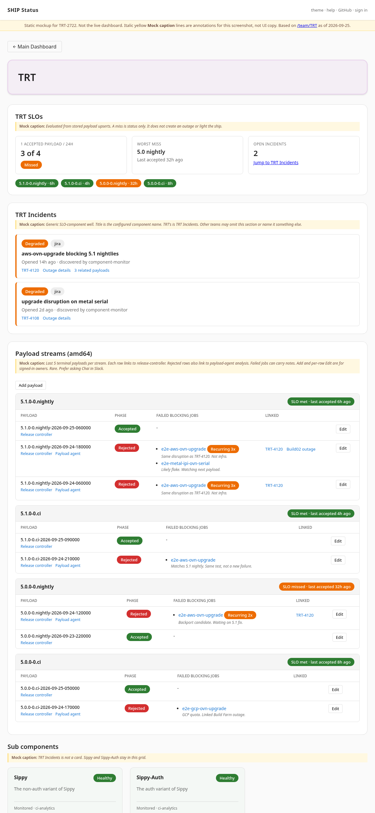
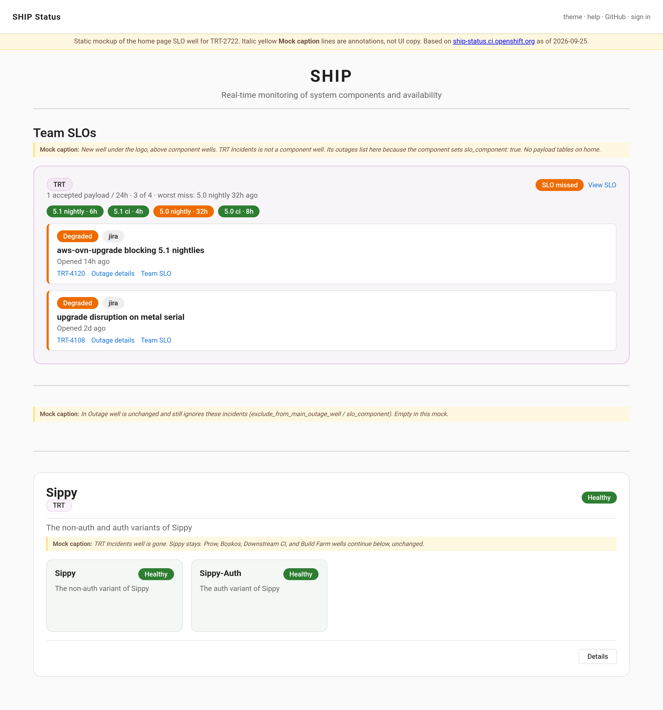

# TRT-2722: Team SLOs and TRT Watcher Canvas in SHIP Status Dash

**Date:** 2026-09-23
**JIRA:** [TRT-2722](https://redhat.atlassian.net/browse/TRT-2722)
**Author:** Stephen Goeddel

Related: [SHIPSTRAT-3](https://redhat.atlassian.net/browse/SHIPSTRAT-3), [TRT-2955](https://redhat.atlassian.net/browse/TRT-2955), [TRT-2433](https://redhat.atlassian.net/browse/TRT-2433), [TRT-2666](https://redhat.atlassian.net/browse/TRT-2666), [TRT-2790](https://redhat.atlassian.net/browse/TRT-2790), [TRT-2609](https://redhat.atlassian.net/browse/TRT-2609)

This is a **dual-repo** plan. SHIP Status Dash is the store, evaluator, and UI. Chai Bot ([openshift-eng/ship-help-bot](https://github.com/openshift-eng/ship-help-bot)) is the producer that already watches payloads and files infra outages. The Slack watcher canvas is on-demand only. Neither repo is a follow-up to the other.

## Problem Statement

TRT-2722 asked whether team SLOs need a high-visibility home-page widget or can reuse existing surfaces. The team page (`/team/:team`, TRT-2433) should be the detailed SLO workspace. The home page gets a small summary widget that bubbles key met/missed status per team and deep-links to that team's SLO section. The full watcher canvas does not live on `/`.

TRT's operational SLO is at least one accepted payload per day on watched amd64 streams. A Slack canvas on `#forum-ocp-release-oversight` still exists; Chai only writes it when someone asks. The live picture moves to ship-status (streams, recent payloads, failed jobs, Jira/outage links). Stop asking Chai to update that canvas. There is no scheduled refresh and no canvas cutover.

ship-status does not poll release-controller or Sippy to populate the SLO. Chai already does that in `PayloadCheckHandler` (`ship_help_bot/tools/_auto/payload_check/`). The bot is responsible for keeping SLO data current. Authorized humans can also add and edit the same records from the team-page UI or by asking Chai in Slack. A missed SLO is an indicator only. Never create an outage because an SLO was missed.

Incident outages on `trt-2955` ([TRT-2955](https://redhat.atlassian.net/browse/TRT-2955)) stay as ship-status outages (`trt-incidents/incidents`, `outage_per_reason`, `exclude_from_main_outage_well`). They should not remain a separate team-page card or home component well. Set `slo_component: true` on that component so list APIs omit it, then show its active outages in the team SLO incidents panel and the home SLO well. Other teams set the same flag on their incident component. Payload rows still link to those outages. They do not replace them.

## Split of responsibilities

| Layer | Owner | Does | Does not |
|-------|--------|------|----------|
| Poll Sippy + release-controller, load payload-agent YAML | Chai `PayloadCheckHandler` (`ocp_payload_ops` / `payload_check_dev`, amd64) | Already lists Accepted/Rejected tags per stream, analysis status, infra jobs | ship-status never grows this poller |
| Payload-agent analysis (TRT-2609) | Existing payload agent | Root-cause YAML/HTML for rejected payloads | Not replaced. Chai consumes the YAML. |
| Infra outages for mapped jobs | Chai `record_payload_infra_outage` (`acting_for=chai-bot`) | Create-or-link Degraded unconfirmed outages, later close from later payloads | Not an SLO miss. Keep this path. |
| TRT incident Jira cards | Chai (`trt_incident_jira` + payload_check revert flow) | File `project=TRT`, labels `trt-incident,ai-generated-jira` | ship-status has no Jira token |
| Incident outages | ship-status `jira_monitor` on `trt-incidents/incidents` | One outage per Jira issue (`outage_per_reason`) | Chai does not copy incidents into `slo_payloads` |
| SLO payload facts (tag, phase, jobs, notes, links) | Chai upserts via authenticated MCP; humans via team page or Slack | Keep last N payloads per configured amd64 stream | LLM does not author the store. Deterministic handler, same as infra writes. |
| SLO met/missed | ship-status, from stored payloads | Count Accepted in `window` per YAML stream | Never open/update/resolve an outage for a miss |
| Watcher UI | ship-status `/team/TRT#slo` | Recurring-job grouping, correlation, add/edit | Home page is a summary chip only |
| Slack | Chai | Payload-check alerts stay. Stop asking for canvas updates. | Do not scrape canvas HTML. No cutover or pointer rewrite. |

Empty or stale SLO rows are a Chai lag problem (handler missed a tag, MCP write failed), not something ship-status backfills.

## Current SHIP Status Dash constraints

- [`frontend/src/components/team/TeamPage.tsx`](frontend/src/components/team/TeamPage.tsx) is only a filtered `SubComponentList` (`GET /api/sub-components?team=`). No SLO section, no custom widgets.
- Outages are tied to component/sub-component slugs. Payload tags are ephemeral. They should not become ship-status components.
- [`GET /api/outages/during`](API_ENDPOINTS.md) already supports time-window and `team` filters. That is the join API for overlapping infra/incident outages.
- Jira probing is anonymous (`jira_monitor`). Do not mount a Jira token. Correlation can use issue keys already stored on incident outages (`Reason.Check` and `link_type=jira`).
- [TRT-2790](https://redhat.atlassian.net/browse/TRT-2790) (build02 Sippy pass ratio) was closed as Won't Do specifically because it belonged on this SLO/team page. Revisit it as a later TRT SLO source. The home widget may show its met/missed bit. The metric detail stays on `/team/TRT#slo`.

## Current Chai Bot constraints

- **Auth path already exists (TRT-2666).** Writes go to authenticated MCP behind oauth-proxy. Chai's SA is a `trusted_delegator`. Identity on the dashboard is `X-Acting-For`: `chai-bot` for autonomous work, OrgData kerberos uid when a human asked in Slack. `chai-bot` is already a `user` owner on components so bot-initiated outages authorize. Team SLO writes need the same string on `team_slos.owners`.
- **Discovery already exists.** `ship_help_bot/tools/ship_status/` builds FunctionTools from MCP `tools/list`. New `get_*` tools on the public MCP and new write tools on the auth MCP appear at persona startup. Do not hard-code a second client. Reads stay `get_*` / `list_*` so they route to the public endpoint.
- **`PayloadCheckHandler` is the poller.** `ocp_payload_ops.payload_check_dev` (every 5 minutes, `architectures: ["amd64"]`, `releases: ocp-dev`) already: asks Sippy which releases are in scope, lists terminal tags (Rejected / Accepted) on ci and nightly streams since a Firestore watermark (`scheduled_state/trt_payload_check`), loads payload-agent YAML, and records ship-status infra outages. `patch_manager.payload_check_ga` is the GA/z-stream sibling and is **out of TRT SLO v1**.
- **Infra writes are a wrapper, not raw `create_outage`.** `record_payload_infra_outage` groups jobs by component/sub-component, queries `get_outages_during`, then creates or links with `bot_initiated=True`, `acting_for=chai-bot`. SLO upserts should follow that pattern: a deterministic helper the handler calls, not an LLM turn that invents payload rows.
- **Rejected-centric today.** ship-status infra backfill runs for every Rejected tag with YAML. Accepted tags are observed only far enough to close infra outages. The SLO needs **Accepted and Rejected** (and Ready when the release-controller still shows it) on every configured amd64 stream (ci and nightly) so "1 accepted / 24h" has a complete window.
- **Slack canvas is on-demand only.** `ocp_payload_ops` and `trt_internal` can `update_canvas` on `forum_ocp_release_oversight_canvas` when a human asks. There is no scheduled canvas-refresh job. Do not scrape that canvas, rewrite it as a pointer, or dual-write. Once `/team/TRT#slo` is live, stop asking Chai to update it. Payload check still posts actionable Slack (reverts, force-accept, newly created ship-status outages).
- **Incident filing stays on Chai.** Revert buttons already create TRT Jira incidents. `trt_internal` has `trt_incident_jira` instructions. The ship-status `jira_monitor` turns those issues into `trt-incidents/incidents` outages. Payload tools only **link** a payload or job group to that outage.
- **RWS exposure.** Raw outage writes stay coordinator-only. `record_payload_infra_outage` is RWS-exposed only for `ocp_payload_ops`. SLO upsert wrappers should match: handler + that persona, not every workspace worker.
- **Missed SLO must not call `create_outage`.** Instructions need an explicit rule. Infra and incident outages remain the only outage writers.

## Recommended product shape

Treat this as three layers:

1. **Home-page SLO summary** (small, all teams): met/missed chips, one line of context, compact `slo_component` incident rows, link to `/team/{team}#slo`. Not the watcher canvas. Does not light the ship-on-fire logo.
2. **Generic SLO status** on the team page: named objectives, window, met/missed, last evaluation (`id="slo"`), plus an incidents panel when the team owns a `slo_component`.
3. **SLO workspace** (pluggable per team, writable): TRT's first extra workspace is the amd64 payload watcher. Chai upserts payload data via MCP. Authorized humans add/edit on the team page or via Chai in Slack. Other teams can omit the payload workspace and still get the SLO strip and incidents panel.

```mermaid
flowchart TB
  subgraph sources [Sources Chai already polls]
    Sippy[Sippy releases API]
    RC[Release-controller amd64]
    Agent[Payload-agent YAML TRT-2609]
  end

  subgraph chai [Chai Bot ship-help-bot]
    Handler[PayloadCheckHandler ocp_payload_ops]
    InfraWrap[record_payload_infra_outage]
    SloWrap[upsert SLO payloads plus links]
    Jira[TRT incident Jira]
    SlackMsg[Slack alerts]
  end

  subgraph shipStatus [SHIP Status Dash]
    YAML[Dashboard YAML SLOs plus owners]
    Store[Persisted SLO workspace]
    Incidents[Incident outages TRT-2955]
    InfraOut[Infra outages]
    WriteAPI["PUT /api/teams/{team}/slo/payloads"]
    AuthMCP[Authenticated MCP write tools]
    DetailAPI["GET /api/teams/{team}/slo"]
    SummaryAPI["GET /api/teams/slo-summary"]
    TeamPage["/team/TRT#slo"]
    Home[Home SLO widget]
  end

  Sippy --> Handler
  RC --> Handler
  Agent --> Handler
  Handler --> InfraWrap --> InfraOut
  Handler --> SloWrap --> AuthMCP --> WriteAPI --> Store
  Handler --> Jira --> Incidents
  Handler --> SlackMsg
  UI[Team page frontend] --> WriteAPI
  SlackHuman[Slack user via Chai] --> AuthMCP
  YAML --> DetailAPI
  Store --> DetailAPI --> TeamPage
  Store --> SummaryAPI --> Home
  Home -->|"team + #slo"| TeamPage
  Incidents --> DetailAPI
  InfraOut --> DetailAPI
```



### TRT team page layout

Keep the existing sub-component grid below. Add sections above it:

**SLO strip** (all teams with config, `id="slo"`): e.g. "Accepted payload / 24h: 3 of 4 streams meeting target." This is the target of the home-page deep link. Missed SLOs are prominent here as status only. Do not light the ship-on-fire logo. Do not create an outage when an SLO is missed.

**Incidents panel** (any team that owns a `slo_component: true` component): active outages from that component, with Jira links and jump-to outage details. This is where `trt-incidents/incidents` is shown for TRT. Same widget for ART/CRT/DPTP when they mark their incident component. Not a `SubComponentCard` in the grid.

**Watcher canvas** (TRT `payload_streams` workspace, amd64 only):

- One row per configured amd64 stream (YAML list, e.g. `5.1.0-0.nightly`, `5.1.0-0.ci`, `5.0.0-0.nightly`, `5.0.0-0.ci`). No arm64/multi/ppc/s390x.
- Last N payloads **on the team page** (`recent_payloads`). The store keeps every tag still inside the SLO `window` so evaluation is not limited to those N rows. Home does not list payloads.
- Recurring-job grouping: same blocking job failing on 2+ consecutive payloads in that stream. Computed by ship-status from stored rows so Chai does not have to send a grouping structure.
- Links: Prow, Jira, ship-status outage details (and any URLs the bot/human attached, including release-controller pages if they send them).
- Correlated ship-status objects beside a payload or a failure group:
  - TRT incident outages whose Jira key appears on the group, or whose window overlaps payload evaluation.
  - Infra outages (`GET /api/outages/during`) so "build02 down" explains a GCP job streak. These are the outages Chai already opened via `record_payload_infra_outage`.
  - Explicit outage/Jira links attached by the bot or the UI.

Authorized users on the team page can add a payload, edit phase/jobs/notes, and add/remove links. Same protected APIs as MCP. Empty/stale data is a bot-lag problem, not something ship-status backfills from release-controller.

### Visual mockup

Static mock of `/team/TRT` with the SLO strip, incidents panel, amd64 payload streams, and the existing Sippy cards. Sample payload/incident data. Layout is based on the live team page ([ship-status.ci.openshift.org/team/TRT](https://ship-status.ci.openshift.org/team/TRT)) as of 2026-09-25, when that page listed Sippy, Sippy-Auth, and Incidents.

Yellow italic lines labeled **Mock caption** are annotations for these screenshots, not product copy.



Home page: In Outage stays first. A Team SLOs well under it lists per-team roll-up and, in a nested well labeled with the component and sub-component names, the `slo_component` incident outages. TRT Incidents is not a component well. Payload tables stay on the team page.



What changed vs today:

- Team header title is the team name (`TRT`), not `TRT Sub Components`.
- New SLO strip (`#slo`) and incidents panel (`#incidents`) above the grid.
- `Incidents` is not a sub-component card (`slo_component: true` on TRT Incidents). Sippy and Sippy-Auth remain.
- Payload streams are tables per amd64 nightly and ci stream (5.0 and 5.1 in the mock), with recurring-job badges and links to Jira/outages.
- Add/edit controls are shown as authorized-user actions. They are not on the public read-only view for anonymous visitors in the real app.

### Home-page SLO widget

Place a compact well on [`frontend/src/components/ComponentStatusList.tsx`](frontend/src/components/ComponentStatusList.tsx) immediately below `UnhealthyWell` (In Outage) and above the component wells. In Outage is always the top well when it has items. Do not put SLOs above it.

Per team in the union of `team_slos` entries and `ship_team` values on any `slo_component` (incident-only teams must appear):

- Team name (existing `TeamChip` color) linking to `/team/{team}#slo`
- If the team has `team_slos`: roll-up (all met / N of M missed), worst-miss hint (e.g. "5.0 nightly: last accepted 32h ago"), stream chips. Click-through goes to `#slo`, not a payload row.
- If the team owns a `slo_component`: a nested well inside that team's SLO block, labeled with the component name and sub-component name (e.g. `TRT Incidents` / `Incidents`). Compact incident rows in that well, not loose under the SLO chips. Link to outage details and `/team/{team}#incidents`.
- A team with only `slo_component` (no `team_slos`) still gets a block: chip plus nested incident well, no payload roll-up.

Rules that keep `/` from becoming the canvas:

- No payload lists, job failures, or correlation on the home widget
- Teams with no SLO config and no `slo_component` are omitted
- Missed SLOs do not put the team in the In Outage well, do not light the ship fire, and do not create an outage.
- Hide the well entirely if no teams have SLOs or `slo_component`s (local/e2e without YAML)
- A `slo_component` is omitted from home `ComponentWell`s. Its outages appear in this SLO well (and the team SLO incidents panel), not as a component card.

### Folding incident components into SLOs

Keep TRT-2955's data model: one ship-status outage per Jira issue, Jira probe, `outage_per_reason`, auto-resolve, existing MCP outage tools. Do not copy incidents into `slo_payloads`.

Do not derive hide-from-list from `team_slos`. That couples two configs and is easy to get wrong. Add an explicit component flag:

```yaml
  - name: "TRT Incidents"
    description: "TRT Jira incidents labeled trt-incident"
    ship_team: "TRT"
    slo_component: true
    sub_components:
      - name: "Incidents"
        exclude_from_main_outage_well: true
        monitoring:
          outage_per_reason: true
          auto_resolve: true
```

`slo_component: true` on the **component**:

Wire it through the config contract, not only YAML examples:

- [`pkg/types/config.go`](pkg/types/config.go) `Component`: add `SLOComponent bool` with `json:"slo_component,omitempty" yaml:"slo_component,omitempty"`. Same pattern as `ExcludeFromMainOutageWell` on the sub. YAML load already unmarshals `Component`; without this field the flag is dropped.
- Frontend [`frontend/src/types.ts`](frontend/src/types.ts) `Component`: add `slo_component?: boolean` so clients can ignore flagged rows if a list handler ever leaks one.
- Set `slo_component: true` on TRT Incidents in [`hack/local/dashboard/config.yaml`](hack/local/dashboard/config.yaml) and the production file in `openshift/release`.

Behavior:

- `GET /api/components` omits it, so there is no home `ComponentWell`.
- `GET /api/sub-components` omits its subs, so `/team/TRT` has no Incidents card (Sippy stays).
- It still does not appear in the In Outage well or light the ship (`exclude_from_main_outage_well` stays on the sub as today; `slo_component` does not replace that).
- `GET /api/teams/{team}/slo` and `GET /api/teams/slo-summary` include its active outages for `ship_team`.
- Home SLO well and `TeamSLOIncidents` render those outages. On home, they live in a nested well labeled with the component and sub-component names.

`team_slos` does not need an `incidents:` pointer. Discovery is: components with `slo_component: true` and matching `ship_team`. A team can have a `slo_component` with no payload SLO, or a payload SLO with no `slo_component`.

| Today | After |
|-------|--------|
| `TRT Incidents` is a home component well and a `/team/TRT` card | Hidden from those grids via `slo_component: true` |
| Incidents only excluded from the In Outage well / ship fire | Also excluded from home component wells and the team sub-component list |
| Team page is a flat card grid | SLO section owns the incident list; home SLO well shows the same outages compactly |

Outage create/update/link/triage stays on the existing component APIs and MCP tools. The SLO panel is a view plus deep links. Payload correlation uses these outages first (Jira key, time overlap, and explicit `slo_payload_links`).

Other teams reuse this with zero TRT UI: add a Jira-monitored incident component, set `slo_component: true` and `ship_team`. Payload workspace remains optional.

### Other teams (same framework, later sources)

Other teams reuse the same SLO page with no TRT-specific UI:

- **Incidents panel first.** Any team can add a Jira-monitored incident component (copy TRT-2955), set `slo_component: true` and `ship_team`. That is enough to get the panel and the home SLO well rows.
- **ART / CRT / DPTP SLOs** later: content cadence, payload creation interval, mass failures (`prometheus` / `time_since_event` sources, or bot upserts). Payload workspace stays TRT-only unless another team wants one. Chai does not need a TRT-shaped handler for those teams in v1.

## Data sources

| Need | Source | Auth |
|------|--------|------|
| Entire TRT SLO workspace (streams' payloads, jobs, notes, Jira keys) | Chai `PayloadCheckHandler` via MCP, or authorized humans via the team-page UI / Slack | oauth-proxy + HMAC + team SLO owners (`chai-bot` for bot-initiated) |
| Open TRT incidents as outages | Existing `jira_monitor` + `outage_per_reason` (issues Chai already files) | Anonymous Browse |
| Overlapping infra/incident outages | `GET /api/outages/during` (includes Chai's `record_payload_infra_outage` rows) | Public read |
| Slack narrative (reverts, force-accept) | Unchanged payload_check Slack path | Existing |

SHIP Status Dash does not poll release-controller, Sippy, or Slack to fill the SLO. Chai (or a human) must upsert payload data. Do not scrape the Slack canvas. Once the team page is live, stop asking Chai to update it.

## Config model

Add team-scoped SLO config to dashboard YAML (production file lives in `openshift/release` `core-services/ship-status/`. Local mirror in [`hack/local/dashboard/config.yaml`](hack/local/dashboard/config.yaml)). Payload SLOs attach to team. Incident components use `slo_component: true` on the component.

Sketch:

```yaml
team_slos:
  - team: TRT
    owners:   # same shape as component owners; required for workspace writes
      - rover_group: "technical-release-team"
      - user: "chai-bot"   # bot-initiated acting-for, same as TRT-2666
    slos:
      - name: accepted-payload-per-day
        display_name: "1 accepted payload per day"
        source: payload_acceptance
        window: 24h
        target: { min_accepted: 1 }
        workspace:
          kind: payload_streams
          recent_payloads: 5   # team-page list size only; evaluation uses the full window
          streams:
            - controller: amd64
              name: "5.1.0-0.nightly"
            - controller: amd64
              name: "5.1.0-0.ci"
            - controller: amd64
              name: "5.0.0-0.nightly"
            - controller: amd64
              name: "5.0.0-0.ci"
```

`source` is the extension point (`payload_acceptance`, `prometheus`, `time_since_event`, later `http`). Unknown sources are ignored so other teams can land config before ship-status implements their evaluator.

If `owners` is omitted, fall back to union of `owners` on components with that `ship_team` so TRT does not need a fake component. Writes never authorize against the public route. Bot-initiated SLO upserts fail closed if `chai-bot` is not an owner (do not rely on the component-owner fallback alone for the SA identity).

## Backend design

Persist the workspace. Do not poll release-controller. SLO met/missed is computed only from stored payloads the bot or UI wrote.

Tables (names indicative):

- `slo_payloads`: team, stream, tag, phase, payload URL, timestamps, failed jobs JSON, notes, `updated_by`, `updated_at`. Unique `(team, stream, tag)`.
- `slo_payload_links`: payload id, url, link_type (`jira` / `outage` / `other`), optional outage_id.

Idempotent upsert by `(team, stream, tag)`. Persist every upserted tag that still falls inside the SLO `window` (24h for TRT). `recent_payloads` is a team-page UI cap only: `/team/{team}` lists the last N rows per stream. The home widget does not list payloads (roll-up, worst-miss, and compact `slo_component` incident rows). Do not prune stored rows down to N. An Accepted tag still inside the window must remain available to `payload_acceptance` even if later Rejected tags have pushed it off the visible list. Prune only rows that are outside both the evaluation window and the last-N display set.

**Public read APIs:**

- `GET /api/teams/{team}/slo`: evaluations from stored payloads in `window` (not limited to last N), `incidents` (active outages from that team's `slo_component`s), and the last-N payload workspace for display.
- `GET /api/teams/slo-summary`: one block per team in the union of `team_slos` and `slo_component` `ship_team`s. Roll-up when `team_slos` exists; compact incident rows grouped by `slo_component` (component name, sub-component name, title, severity, Jira, outage id). No payload/job lists.
- `GET /api/components` and `GET /api/sub-components` omit `slo_component: true` components (and their subs).

**Protected write APIs** (oauth-proxy + HMAC + `IsUserAuthorizedForTeamSLO`). Used by MCP and the frontend:

- `PUT /api/teams/{team}/slo/payloads`: create or replace one payload (phase, jobs, notes).
- `PATCH` (or PUT of a subset) for edits.
- `PUT /api/teams/{team}/slo/payloads/{stream}/{tag}/links`: attach Jira or outage.
- `DELETE` for payload or link mistakes.

Evaluate `payload_acceptance` from stored payloads: count Accepted in `window` per configured amd64 stream. Missed SLO is a boolean/count on the read APIs only. Never open, update, or resolve a ship-status outage because an SLO was missed.

## Chai Bot (ship-help-bot) design

Reuse the TRT-2666 path. Contract lives in this repo (REST + MCP). Producer lives in ship-help-bot.

### MCP contract (this repo)

**Public MCP (read):**

- `get_team_slo(team)`
- `get_team_slo_summary()`

Name them `get_*` so Chai's ship_status discovery routes them to the public endpoint automatically.

**Authenticated MCP (write), `acting_for` required:**

- `upsert_slo_payload(team, stream, tag, phase, jobs, notes, acting_for, ...)`
- `add_slo_payload_link(team, stream, tag, url, link_type, outage_id?, acting_for)`
- Existing `create_outage` / `add_outage_link` stay the way to file a TRT incident or infra outage. Payload tools link to that outage rather than duplicating it.

Bot-initiated: `acting_for: chai-bot` (locked, same owner string as TRT-2666). User-initiated in Slack: OrgData uid as today. Frontend writes use the logged-in user (no acting-for). Dashboard audit logs the acting identity (`chai-bot` or the human).

Do not mount a Jira token on ship-status. Chai already has Jira tools. It sends issue keys/URLs in the upsert or as links.

### Producer: extend PayloadCheckHandler, do not add a second poller

Owner persona: **`ocp_payload_ops`** (`payload_check_dev`, amd64, `ocp-dev`). Not `patch_manager` (GA) and not a new scheduled persona.

On each tick, after the existing Sippy / release-controller / YAML load:

1. For each YAML-configured amd64 stream (ci and nightly, the same list as `workspace.streams`), upsert every new or updated terminal tag in the recent window (Accepted, Rejected, and Ready if still listed). Include phase, payload URL, timestamps, failed blocking jobs from verification jobs / payload-agent YAML when present, and analysis HTML URL as a link.
2. Keep calling `record_payload_infra_outage` for Rejected tags with mapped infra jobs. Unchanged.
3. When that wrapper creates or links an outage, also `add_slo_payload_link(..., link_type=outage, outage_id=...)`.
4. When the Slack revert flow files a TRT incident Jira, `add_slo_payload_link(..., link_type=jira)` for the affected payload(s). Do not wait for jira_monitor; the incidents panel will catch up.
5. SLO writes on this tick stay best-effort relative to the Firestore watermark: do not hold the watermark forever if ship-status is down (same as today's infra writes). When an upsert fails, post a Slack message a human can act on. Include stream, tag, error, and whether the watermark advanced past that tag. There is no automatic failed-tag queue and no automatic post-watermark Ready-to-Accepted reconciliation in v1.

Human recovery after a failed or skipped write (watermark may already have moved):

- Ask Chai in Slack to refresh that stream and tag. This is a required **interactive skill** in ship-help-bot: look up the current phase (and jobs) from the same Sippy / release-controller sources `PayloadCheckHandler` already uses, then `upsert_slo_payload`. Independent of the Firestore watermark. The LLM only chooses to invoke it on explicit user intent. It does not invent phase or jobs. Covers a Slack write-failure alert, a payload missing from the SLO page, and a stale `Ready` row that later Accepted or Rejected.
- Or team page add/edit (same protected `PUT` as MCP).

The Slack failure message should point at the interactive skill and link `/team/TRT#slo`. Do not add a second scheduled poller or a failed-tag queue to recover these. If nobody asks Chai, someone will eventually notice the gap on the team page and ask then.

Implement a coordinator-side wrapper (same shape as `record_payload_infra_outage` in `payload_infra.py`): `acting_for=chai-bot`, groups/idempotent, sandbox fake for tests. The LLM must not be the thing that decides payload rows.

Persona-callable tools remain for humans ("add a note on 5.1 nightly 2026-09-23-…", "link TRT-1234 to this payload", "refresh 5.1.0-0.nightly-2026-09-25-060000 on the SLO"). Those use OrgData `acting_for`. Instructions: only on explicit user intent, same as raw `create_outage`.

### Slack canvas

The oversight canvas is on-demand only. No scheduled writer, so no cutover: do not dual-write, do not replace the canvas body with a ship-status URL, do not scrape it. After `/team/TRT#slo` is the live view, stop asking Chai to `update_canvas` for payload/SLO status.

**Alerts stay in Slack.** Revert / force-accept / new infra outage posts from payload_check do not move into the dashboard. Failed SLO upserts also post to Slack (stream, tag, error, watermark status) so a human can ask Chai to refresh that tag.

### Instructions and safety

Update in ship-help-bot (not this repo):

- `ship_help_bot/tools/ship_status/instructions/02_write_tools.md`: new upsert/link tools, `acting_for` rules, **never create an outage because an SLO was missed**.
- `ship_help_bot/tools/_auto/payload_check/README.md` and handler module doc: SLO upsert steps beside infra backfill.
- `trt_payload_check_handler.md`: mention the ship-status team-page URL when posting; do not treat SLO miss as an incident. Slack failed SLO upserts with stream, tag, error, watermark status, and how to ask Chai to refresh that tag.
- Interactive skill: on explicit user intent, fetch current phase for a named stream and tag and upsert it, independent of the Firestore watermark. Same skill for missing payloads and stale `Ready` rows.
- RWS: expose the upsert wrapper only to `ocp_payload_ops`, same as `record_payload_infra_outage`. Keep raw SLO writes off workspace workers.

### What Chai does not do in v1

- Evaluate met/missed (ship-status does that from stored rows).
- Recurring-job grouping (ship-status derives it).
- Poll on behalf of ART/CRT/DPTP SLOs.
- Replace the payload agent.
- Open a ship-status outage per rejected payload or per missed SLO.
- Automatically reconcile `Ready` rows after the Firestore watermark has passed. Humans ask Chai to refresh a specific tag.

## Frontend design

**Team page** ([`frontend/src/components/team/TeamPage.tsx`](frontend/src/components/team/TeamPage.tsx)):

1. Fetch `/api/teams/{team}/slo`. If empty, keep today's page.
2. `TeamSLOStatus` strip with `id="slo"` (generic). Scroll into view when the hash is `#slo`.
3. If the team has a `slo_component`, render `TeamSLOIncidents` (`id="incidents"`) with active outage rows linking to existing details pages.
4. If workspace `kind === payload_streams`, render `PayloadStreamWorkspace` (TRT amd64). When the viewer is authorized (same pattern as outage actions), show add/edit: new payload on a stream, edit phase/jobs/notes, add/remove Jira and outage links. Writes go to the protected API.
5. Existing `SubComponentList` unchanged except list APIs no longer return `slo_component` subs.

Deep links: `/team/TRT#slo` from the home widget, `/team/TRT#stream-5.1.0-0.nightly` within the canvas, outage details and Jira browse URLs from failure groups.

**Home page** ([`frontend/src/components/ComponentStatusList.tsx`](frontend/src/components/ComponentStatusList.tsx)):

1. Fetch `/api/teams/slo-summary` next to the existing components/status polls.
2. If the payload is non-empty, render `TeamSLOSummaryWell` **after** `UnhealthyWell` and before the component wells. In Outage stays the top well. Include teams that have only a `slo_component`.
3. Each team block is a `TeamChip` plus SLO roll-up plus worst-miss hint. Under that, a nested well per `slo_component` labeled with component and sub-component names, containing compact incident rows. "View SLO" navigates to `/team/{team}#slo`. Incident rows link to outage details.

Public route is read-only. All SLO mutations (bot MCP and frontend add/edit) use the protected route and `IsUserAuthorizedForTeamSLO`. `chai-bot` is an owner for bot-initiated MCP. Human UI users must be a rover-group/user owner of that team SLO.

## Correlation with incident outages (TRT-2955)

The SLO incidents panel is the TRT-2955 list, not a second copy. Correlation is then:

- Show those active outages in `TeamSLOIncidents`.
- For each recurring job group, list incident outages whose Jira key is already linked (`add_slo_payload_link` or `Reason.Check` match), or whose window overlaps the failing payload span.
- For each payload, also list overlapping Build Farm / Prow outages so infra vs product is visible. Those rows are often ones Chai already created with `record_payload_infra_outage`.
- Click through to existing outage details (triage notes, Slack thread, Jira).

Chai keeps filing incident Jira (then ship-status `jira_monitor`) and infra outages via existing MCP outage tools. Payload tools only link a payload/job group to that outage. Canvas-style notes on a payload stay on `slo_payloads.notes`. Incident write-up stays on the outage.

## Phasing

Work both repos in this order. ship-status contract first so Chai can integrate against it.

1. **ship-status: config + store + read APIs + SLO strip + home summary.** Persist empty workspace. Team page `id="slo"`. Home widget links to `/team/{team}#slo`. Include `chai-bot` on `team_slos.owners` in local YAML.
2. **ship-status: `slo_component` + incidents panel.** Flag on TRT Incidents, omit from home/team list APIs, `TeamSLOIncidents` plus incident rows on the home SLO well. TRT-2955 stays the outage backend.
3. **ship-status: protected writes + authenticated MCP** for payloads. `upsert_slo_payload` / `add_slo_payload_link`. Wire local e2e with chai-bot SA and `X-Acting-For`. This is the contract Chai consumes.
4. **ship-status: watcher workspace UI** from persisted rows (jobs, recurring badges, notes) plus frontend add/edit. No release-controller fill-in. Join payload rows to the incidents panel.
5. **Chai: deterministic SLO upserts** in `PayloadCheckHandler` / `payload_infra`-style wrapper. Accepted + Rejected (+ Ready) on every configured amd64 stream (ci and nightly). Link infra outages and Jira keys. Slack on upsert failure with enough detail for a human to replay. Instructions: never outage-on-SLO-miss; stop asking for Slack canvas updates. Tests around the handler, not wording in an LLM reply.
6. **Other teams** add `slo_component: true` (and later their own `team_slos`) without a payload workspace and without a Chai payload handler.

SHIP Status Dash v1 is complete when Chai can upsert and the team page renders it. Chai v1 is complete when amd64 ci and nightly tags land in ship-status on the existing 5-minute tick without an LLM authoring the rows.

## Explicit non-goals (v1)

- Putting the payload watcher canvas on the home page.
- Lighting the ship-on-fire logo, adding SLO misses to the In Outage well, or creating any outage when an SLO is missed.
- One ship-status outage per rejected payload.
- Copying incident outages into `slo_payloads`. Incidents stay outages. The SLO page is the view.
- Polling release-controller, Sippy, or Slack from the dashboard to populate SLO data.
- A second Chai poller, automatic post-watermark Ready-to-Accepted reconciliation, or using `patch_manager.payload_check_ga` for this SLO.
- Letting an LLM turn be the source of SLO payload rows.
- Non-amd64 streams (arm64, multi, ppc64le, s390x).
- Scraping, mirroring, dual-writing, or rewriting the Slack canvas as a pointer. It is on-demand only; stop asking for updates.
- Iframe of Sippy or the edge payload-monitor HTML.
- Replacing Sippy component readiness or the payload agent (TRT-2609). Chai remains the producer. ship-status is the store/UI.
- Authenticated Jira search from ship-status pods. Chai or the UI sends keys/URLs.

## Locked decisions

- Streams: amd64 ci and nightly (YAML list of stream names). Not arm64/multi/ppc/s390x. Not GA/z-stream (`payload_check_ga`).
- Data plane: Chai (and humans) write everything. ship-status does not poll release-controller. Chai extends `PayloadCheckHandler`, it does not add a parallel poller.
- Frontend add/edit is in scope, same APIs as MCP, not bot-only.
- Bot `acting_for` / owner user string: `chai-bot`.
- Missed SLO: status indicator only, never an outage. Infra and incident outage paths stay as they are.
- Incidents: keep `trt-incidents` outages. Set `slo_component: true` on that component so list APIs omit it. Show the outages on the team SLO panel and the home SLO well. Other teams set the same flag.
- Failed SLO upsert: do not block the Firestore watermark. Slack the failure (stream, tag, error, whether the watermark advanced). A human asks Chai to refresh that tag, or edits on the team page. No automatic failed-tag queue and no automatic post-watermark phase reconciliation in v1.
- Interactive Chai skill: fetch current phase for a requested stream and tag, then upsert. Independent of the watermark. Used after a write-failure Slack, a missing payload, or a stale `Ready` row.
- Persist SLO payload rows for the full evaluation `window`. `recent_payloads` is team-page display-only. The home widget does not list payloads. An in-window Accepted tag is never pruned just because later tags filled the last-N list.
- Slack canvas: on-demand only. Stop asking Chai to update it. No cutover. ship-status never scrapes it.
- Recurring-job grouping: ship-status, from stored payloads.

## Implementation todos

**SHIP Status Dash (this repo)**

- Define `team_slos` YAML (including `chai-bot` owners), public read APIs, persisted workspace store, TeamPage SLO strip, and home-page widget linking to `#slo`.
- Render TRT amd64 `payload_streams` from persisted upserts only (no release-controller poll): last N **displayed on the team page**, failed jobs, recurring-job grouping, plus frontend add/edit. Evaluation uses the full `window`. Home widget stays roll-up plus compact incident rows, no payload tables.
- Protected write API plus authenticated MCP tools so Chai can upsert TRT payload/SLO workspace data (`acting-for`, same path as TRT-2666). E2e with chai-bot SA.
- Add `SLOComponent` on `types.Component` in `pkg/types/config.go` (and `slo_component` on the frontend `Component` type). Set it on TRT Incidents in local YAML. Filter list APIs on that field.
- Generic team SLO incidents panel backed by `slo_component: true` (TRT Incidents first). Omit those components from home/team list APIs. List their outages on the home SLO well. Reuse for other teams.
- Add `prometheus` / `time_since_event` sources so ART, CRT, and DPTP can use the same team-page SLO strip. Incidents panel is already generic via YAML.

**Chai Bot (ship-help-bot)**

- Wrapper + `PayloadCheckHandler` upserts for every configured amd64 stream (ci and nightly; Accepted/Rejected/Ready), `acting_for=chai-bot`. Do not hold the Firestore watermark on ship-status errors.
- Slack a human when an SLO upsert fails: stream, tag, error, watermark status, and how to ask Chai to refresh that tag.
- Interactive skill: on user request, look up a named stream and tag and upsert it (watermark-independent). Covers write failures, missing payloads, and stale `Ready` rows.
- After `record_payload_infra_outage` create/link, attach `slo_payload_links` (`outage`). After incident Jira create, attach `jira` links.
- Persona tools for human Slack edits (OrgData `acting_for`). Instructions: explicit intent only, never outage-on-SLO-miss, RWS exposure matches infra wrapper.
- Stop asking Chai to update the Slack payload canvas once the team page is live. Do not scrape it or rewrite it as a pointer.
